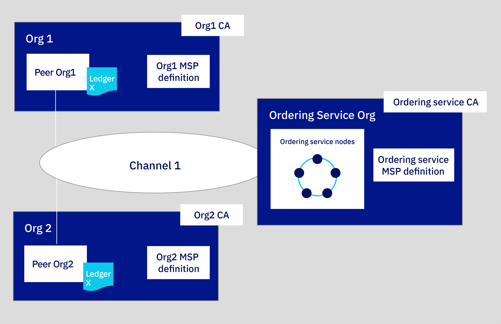
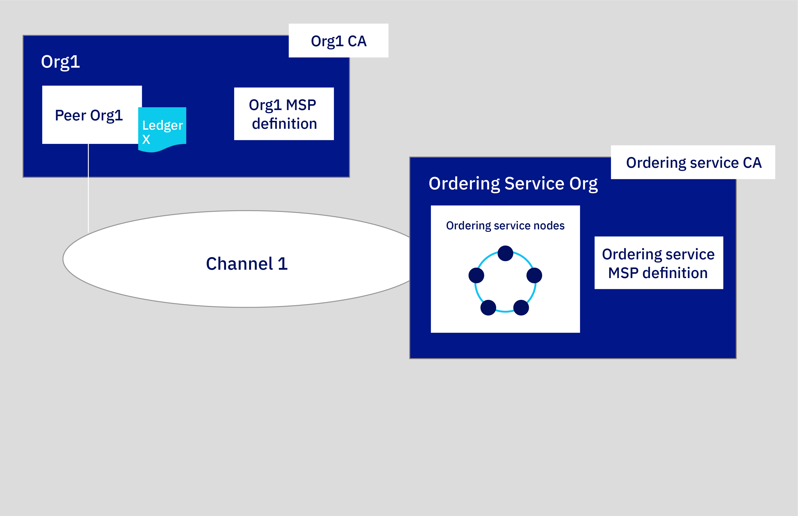

# Build a network

**Target audience:** This topic is designed for network operators who are responsible for creating, monitoring, and managing the hyperledger fabric network.

If you have not already deployed your Fabric Operatons Console to a cluster, see [getting started with Fabric Operatons Console](../index.md).

You need to pay close attention to the resources at your disposal when you choose to deploy nodes and create channels. It is your responsibility to manage your cluster and deploy additional resources if necessary. 

## Sample network tutorial series

This three-part tutorial series guides you through the process of creating and interconnecting a relatively simple, multi-node Hyperledger Fabric network by using the Fabric Operatons Console to deploy a network into your cluster and deploy a smart contract.

* **Build a network tutorial** This tutorial guides you through the process of hosting a network by creating two organizations, one for your peer and another for your ordering service, and a channel. Use this tutorial if you want to form a fabric consortium by creating an ordering service and adding organizations.
* [Join a network tutorial](../getting_started/console-join-network.md) guides you through the process of joining an existing network by creating a peer and joining it to an existing channel. Use this tutorial if you either do not intend to host a network by creating an ordering service, or want to learn the process for joining other networks.
* [Deploy a smart contract on the network using Fabric v2.x](../smart_contracts/console-smart-contracts-v2.md) shows how to write a smart contract and deploy it on a network.

### The structure of this network

If you complete all the steps in the **Build a network** and **Join a network** tutorials, your network will resemble the one in the illustration below:

 <em>Figure 1. Sample basic network structure.</em>

This configuration is sufficient both for testing applications and smart contracts and as a guide for building components and joining production networks that will suit your own use case. The network contains the following components:

* **Two peer organizations**: `Org1` and `Org2`  
  The tutorial series describe how to create two peer organizations and two associated peers. Think of organizations on a fabric network to be like two different banks that need to transact with each other. We will create the definitions of `Org1` and `Org2`.
* **One ordering service organization**: `Ordering Service`  
  Because we are building a distributed ledger, the peers and ordering service should be part of separate organizations. Therefore, a separate organization is created for the ordering service. Among other things, an ordering service orders the blocks of transactions that are sent to the peers to be written to their ledgers and become the fabric. We will create the definition of the `Ordering Service` organization.
* **Three Certificate Authorities (CAs)**: `Org1 CA, Org2 CA, Ordering Service CA`   
  A CA is the node that issues certificates to both the users and the nodes associated with an organization. Because it’s a best practice to deploy one CA per organization, we will deploy three CAs in total: one for each peer organization and one for the ordering service organization. These CAs will also create the definition of each organization, which is encapsulated by a Membership Service Provider (MSP). A TLS CA is automatically deployed together with each organization CA and provides the TLS certificates that are used for communication between nodes. For more information, see [using your TLS CA](../using_console/console-identities.md#using-your-tls-ca).
* **One ordering service:** `Ordering Service` The crash fault tolerant five node ordering service uses an implementation of the Raft protocol (for more information about Raft, see <a href="https://hyperledger-fabric.readthedocs.io/en/release-2.2/orderer/ordering_service.html#raft" target="_blank">the Ordering Service </a> and is the deployment option this tutorial will feature. This ordering service will add peer organizations to its "consortium", which is the list of peer organizations that can create channels. Currently, only one ordering service organization per ordering service is supported, regardless of the number of ordering nodes associated with that organization. This ordering service will add peer organizations to its "consortium", which is the list of peer organizations that can create and join channels. If you want to create a channel that has organizations deployed in different clusters, which is how most production networks will be structured, the ordering service admin will need to import a peer organization that has been deployed in another console into their console. This allows the peer organization to join the channel that is hosted on that ordering service.
* **Two peers:** `Peer Org1` and `Peer Org2`  
  The ledger, `Ledger x` in the illustration above, is maintained by distributed peers. These peers are deployed with <a href="https://hyperledger-fabric.readthedocs.io/en/release-2.2/couchdb_as_state_database.html" target="_blank">Couch DB </a> as the state database in a separate container associated with the peer. This database holds the current value of all "state" (as represented by key-value pairs). For example, saying that `Org1` (a value) is the current owner of a bank asset (the key). The fabric, the list of transactions, is stored locally on the peer.
* **One channel**: `channel1`  
  Channels allow sets of organizations to transact without exposing their data to organizations that are not members of the channel. Each channel has its own ledger, collectively managed by the peers joined to that channel. The tutorial creates one channel that is joined by both organizations, and shows how to instantiate a smart contract on the channel that the organizations can use to transact.

This configuration isn't mandatory. The Fabric Operatons Console is highly customizable. If you have resources available in your Kubernetes cluster, you can use the console to deploy components in an endless array of configurations. This tutorial provides the steps that you need to build your own network, with references to topics that provide a deeper dive into the consoles.

>**_IMPORTANT:_** You can deploy multiple peers that belong to the same organization MSP and multiple orderers that belong to a different organization MSP. But the console does not prevent you from configuring peers and ordering nodes that belong to a single same organization MSP. While it might seem that a single organization MSP for all your nodes would greatly simplify deployment of your network, this configuration is problematic. Because the process to renew certificates is different for peer and ordering nodes, when the renewal process is attempted after the node certificates expire in one year, **certificate renewal will fail**.  For that reason, using the same MSP for your peers and ordering nodes is strongly discouraged.

In this **build a network** tutorial, we build only a portion of the network above, a simple network that can be used to host an ordering service and a single peer organization and peer on a single channel. The following illustration shows the portion of the network above that we will build:

 <em>Figure 1. Sample basic network structure.</em>

This configuration is useful for quickly getting started and testing a smart contract but is not very meaningful until you add other organizations to transact with, creating a truly distributed network. Therefore, in the subsequent [join a network](../getting_started/console-join-network.md) tutorial, we show you how to create additional peer organizations and peers, and how to add a new organization to the channel.

>**_TIP:_** Throughout this tutorial we supply **recommended values** for the fields in the console. This allows the names and identities to be easier to recognize in the tabs and drop-down lists. These values are not mandatory, but you will find them helpful, especially since you will have to remember certain values like IDs and secrets of registered users that you input in previous steps. As these values are not stored in the console, if you forget them, you will have to register additional users and start the process over again. We provide a table of the recommended values after each task and recommend that if you do not use the recommended values that you record your values as you proceed through the tutorial.

## Step one: Create a peer organization and a peer

For each organization that you want to create with the console, you should deploy at least one CA. A CA is the node that issues certificates to all network participants (peers, ordering services, clients, admins, and so on). These identities, which include a signing certificate and private key, allow network participants to communicate, authenticate, and ultimately transact. These CAs will create all of the identities and certificates that belong to your organization, in addition to defining the organization itself. You can then use those identities to deploy nodes, create admin identities, and submit transactions. For more information about your CA and the identities that you will need to create, see [managing identities](../using_console/console-identities.md).

### Creating your peer organization's CA

>**_IMPORTANT:_** Your CA issues the certificates and private keys for your organization's admins, client applications, and nodes. These identities are not managed by Fabric Operatons Console and the private keys are not stored in the console. They are only stored in your browser local storage. Therefore, make sure to export your identities and the MSP of your organization. If you attempt to access the console from a different machine or a different browser, you will need to import these identities and organization definitions.

To create the CA that will issue certificates for your first organization, perform the following steps in your console:

1. Navigate to the **Nodes** tab on the left and click **Add Certificate Authority**. The side panels will allow you to customize the CA that you want to create and the organization that this CA will issue keys for.
2. In this tutorial, we're creating nodes, as opposed to importing them, so make sure the option to **Create a Certificate Authority** is selected. Then click **Next**.
3. Use the side panel to give your CA a **display name**. Our recommended value for this CA is `Org1 CA`. Then give your CA admin credentials by specifying a **CA administrator enroll ID** of `admin` and a secret of `adminpw`. Again, these are **recommended values**.
4. Review the Summary page, then click **Add Certificate Authority**. The **Edit configuration JSON** button allows you to override configuration settings for the CA. In addition to the CA settings that are provided in the console when you provision a CA, you have the option to override some of the settings. If you are familiar with the Hyperledger Fabric CA server, these settings are configured in the <a href="https://hyperledger-fabric-ca.readthedocs.io/en/release-1.4/serverconfig.html" target="_blank">`fabric-ca-server-config.yaml` </a> file when a CA is deployed. The Fabric Operatons Console configures these fields for you with default settings. Therefore, many of these fields are not exposed by the console. But the console also includes a panel where you can edit a `JSON` to override a set of these parameters before a CA is deployed.

**Task: Creating the peer organization CA**

  | **Field** | **Display name** | **Enroll ID** | **Secret** |
  | ------------------------- |-----------|-----------|-----------|
  | **Create CA** | Org1 CA  | admin | adminpw |
  
<em>Table 1. Creating the peer organization CA.</em>

After you deploy the CA, you need to associate an admin identity. This will allow you to operate your CA and use it to create your organization MSP, register users, and your **peer**.

### Associating the CA admin identity

Each CA node is created with a CA admin identity. You use the admin identity to register new users with your CA and generate certificates. Before you can use the console to operate your CA, you need to associate the CA admin identity with the CA node itself.

>**_IMPORTANT:_** Depending on your cluster type, deployment of the CA can take up to ten minutes. When the CA is first deployed (or when the CA is otherwise unavailable), the status indicator box in the CA tile is a flashing gray box. When the CA is successfully deployed and is running, this box is green, indicating that it is "Running" and can be operated from the console. Before proceeding with the steps below, you must wait until the CA status is "Running". If the gray box stops blinking, you can try reloading the page in your browser to refresh the status.

After the CA is running, as indicated by the green box in the tile, complete the following steps:

1. Click the `Org1 CA` tile in the **Nodes** tab. Then click **Associate identity** on the CA overview panel.
2. On the side panel that opens, provide an **Enroll ID** of `admin` and an **Enroll secret** of `adminpw`. For the **Identity display name**, you can use the default value of `Org1 CA Admin`.
3. Click **Associate identity** to add the identity into your console Wallet and associate the admin identity with your CA.

After setting the CA admin identity, you will be able to see the table of registered users in the CA overview panel.

**Task: Associate identity**

   |  **Field** | **Display name** | **Enroll ID** | **Secret** |
  | ------------------------- |-----------|-----------|-----------|-----------|
  | **Enroll ID** |  Org1 CA Admin | admin | adminpw |
  
<em>Table 2. Associate the CA admin identity.</em>

You can view the CA admin identity in your console Wallet by clicking on the **Wallet** in the left navigation. Click the identity to view the certificate and private key of the CA admin.

**Task: Check your Wallet**

  | **Field** |  **Display name** | **Description** |
  | ------------------------- |-----------|----------|
  | **Identity** | Org1 CA Admin | Org1 CA admin identity |
  
<em>Table 3. Check your Wallet.</em>

>**_IMPORTANT:_** The identity is not stored in your console or managed by Fabric Operatons Console. It is only stored in local browser storage. If you change browsers, you will need to import this identity into your Wallet to be able to operate the CA. Click **Export identity** to download the identity along with its certificate and private key.

### Using your CA to register identities

Each node or application that you want to create needs a certificate and private key to participate in the fabric network. You also need to create admin identities for your nodes so that you can manage them from the console. We will use our peer organization CA to register two identities:

* **An organization admin**: This identity allows you to operate nodes using the platform console.
* **A peer identity**: This is the identity of the peer itself. Whenever a peer performs an action (for example, endorsing a transaction) it will sign using its certificate.

Once you have associated the CA admin, you can use the CA tile to create these identities by completing the following steps:

1. Click the `Org1 CA` tile and ensure the `admin` identity that you created for the CA is visible in the table. Then click the **Register user** button.
2. First we'll register the organization admin, which we can do by giving an **Enroll ID** of `org1admin` and a **secret** of `org1adminpw`. Then set the `Type` for this identity as `admin`.  You can ignore the **Maximum enrollments** field. If you want to learn more about enrollments, see [registering identities](../using_console/console-identities.md#registering-identities). Click **Next**.
3. This tutorial does not configure attributes on identities, see [registering identities](../using_console/console-identities.md#registering-identities) if you want to learn more. Click **Register user**.
4. After the organization admin has been registered, repeat this same process for the identity of the peer (also using the `Org1 CA`). For the peer identity, give an enroll ID of `peer1` and a secret of `peer1pw`. This is a node identity, so select `peer` as the **Type**. You can ignore the **Maximum enrollments** field and, on the next panel, do not assign any **Attributes**, as before.

>**_NOTE:_** Registering these identities with the CA is only the first step in **creating** an identity. You will not be able to use these identities until they have been **enrolled**. Enrollment is the process that generates the certificate and private key for the registered user.  For the `org1admin` identity, this will happen during the creation of the MSP, which we will see in the next step. In the case of the peer1 identity, it happens during the creation of the peer.

**Task: Register users**

  |  **Field** | **Description** | **Enroll ID** | **Secret** | **Type** |
  | ------------------------- |-----------|-----------|-----------|-----------|
  | **Create CA**  | CA admin | admin | adminpw | client |
  | **Register users** | Org1 admin | org1admin | org1adminpw | admin |
  | | Peer identity |  peer1 | peer1pw | peer |
  
<em>Table 4. Using your CA to register users.</em>

### Creating the peer organization MSP definition

Now that we have created the peer's CA and used it to **register** identities for the `Org1` admin and for the `Org1` peer, we need to create a formal definition of the peer's organization, which is known as an MSP. Note that many peers can belong to an organization. **You do not need to create a new organization every time you create a peer**. Because this is the first time that we go through the tutorial, we will create the MSP definition for this organization. During the process of creating the MSP, we will enroll the `org1admin` identity and add it to our Wallet.

1. Navigate to the **Organizations** tab in the left navigation and click **Create MSP definition**.
2. On the first panel, enter `Org1 MSP` as the organization MSP display name and `org1msp` and as the MSP ID. If you plan to specify an MSP other than `org1msp`, make sure to review the guidelines for MSP names in the tooltip. Click **Next**.
3. On the **Root Certificate Authority details** panel, specify the CA you used to register the identities for this organization. If this is your first time through this tutorial, you should only see one: `Org1 CA`. The CA root certificate and TLS CA root certificate are displayed. Click **Next**.
4. On the **Admin certificates panel**, select the enroll ID you created for your organization admin from the drop-down list, `org1admin`, and enter its associated secret, `org1adminpw`. Then, give this identity a display name, `Org1 MSP Admin`. Note: the default display name for this identity is the name of your MSP and the word "Admin". If you select a different name for your MSP, that will be reflected in the default.
5. Click the **Generate** button to enroll this identity as the admin of your organization and export the identity to the Wallet, where it will be used when creating the peer and creating channels.
6. Click **Export** to export the admin certificates to your file system. As we said above, this identity is not stored in your console or managed by Fabric Operatons Console. It is only stored in local browser storage. If you change browsers, you will need to import this identity into your Wallet to be able to administer the peer. Click **Next**.  
    >**_IMPORTANT:_** Exporting your organization admin identity is important because you are responsible for managing and securing these certificates. If you switch browsers, you will need to import this admin identity otherwise you will not be able to operate Org1.
7. On the **Review MSP information** panel, make sure you have entered the correct information. When you are satisfied, click **Create MSP definition**.
8. After the MSP has been created, click on the tile representing it. Then **download** the MSP to your local filesystem. You will need to send this MSP to all of the organizations the channels you join.

**Task: Create the peer organization MSP**

  |  | **Display name** | **MSP ID** | **Enroll ID**  | **Secret** |
  | ------------------------- |-----------|-----------|-----------|-----------|
  | **Create Organization** | Org1 MSP | org1msp |||
  | **Root CA** | Org1 CA ||||
  | **Org Admin Cert** | |  | org1admin | org1adminpw |
  | **Identity** | Org1 MSP Admin |||||
  
<em>Table 5. Create the peer organization MSP definition.</em>

After you have created the MSP, you should be able to see the peer organization admin in your console **Wallet**.

**Task: Check your Wallet**

  | **Field** |  **Display name** | **Description** |
  | ------------------------- |-----------|----------|
  | **Identity** | Org1 CA Admin | Org1 admin identity |
  | **Identity** | Org1 MSP Admin | Org1 MSP admin identity |
  
<em>Table 6. Check your Wallet.</em>

For more information about MSPs, see [managing organizations](../using_console/console-organizations.md#managing-organizations).

### Creating a peer

After you have [created the Org1 CA](#creating-your-peer-organizations-ca), used it to register Org1 identities, and created the [Org1 MSP](#creating-the-peer-organization-msp-definition), you're ready to create a peer for Org1.

**What role do peers play?**  

It's important to remember that organizations themselves do not maintain ledgers. Peers do. Organizations also use peers to sign transaction proposals and approve channel configuration updates. Because having at least two peers per organization on a channel makes them highly available, having three peers per organization joined to a channel is considered a best practice for production level implementations because it ensures high availability even while a peer is down for maintenance. In this tutorial though, we'll only show the process for creating a single peer. You can replicate the process to suit your own business needs.

From a resource allocation perspective, it is possible to join the same peers to multiple channels. The design of the peer ensures that the data from one channel cannot pass to another through the peer. However, because the peer will store a separate ledger for each channel, it is necessary to ensure that the peer has enough processing power and storage to handle the transaction and data load.

#### Deploying your peer

Use your console to perform the following steps:

1. From the **Nodes** tab, click **Add peer**.
2. Make sure the option to **Create a peer** is selected. Then click **Next**.
3. Give your peer a **Display name** of `Peer Org1`.
4. The **Advanced deployment options** can be safely ignored for purposes of this tutorial. 
5. Click **Next**.
6. On the **Enter peer information** page:
   * Select `Org1 CA`, as this is the CA you used to register the peer identity.
   * Select the **Enroll ID** for the peer identity that you created for your peer from the drop-down list, `peer1`, and enter its associated **secret**, `peer1pw`.
   * Then, select `Org1 MSP` from the drop-down list
   * The **TLS Certificate Signing Request (CSR) hostname** is an option available to advanced users who want to specify a custom domain name that can be used to address the peer endpoint. Custom domain names are not a part of this tutorial, so leave the **TLS CSR hostname** blank for now.
   * In the **Fabric version** drop-down list, the best practice is to select the **latest available version**, as it will contain the latest bug fixes. It might also be necessary to select the latest version in order to have access to the latest features. Note that if you select any version higher than v2.0, no smart contract container will be deployed along with your peer. Instead, each smart contract will be deployed into its own pod when it is deployed on the channel or invoked for the first time. Golang smart contracts that are currently running on a Fabric v1.4 peer need to be upgraded if you plan to run them on a Fabric v2.x peer. See this [topic](../smart_contracts/console-smart-contracts-v2.md#vendoring-smart-contracts) on vendoring the shim for more information.
   * Click **Next**.
7. The last side panel asks you to **Associate an identity** to make it the admin of your peer. For the purpose of this tutorial, make your organization admin, `Org1 MSP Admin`, the admin of your peer as well. It is possible to register and enroll a different identity with the `Org1 CA` and make that identity the admin of your peer, but this tutorial uses the `Org1 MSP Admin` identity.
8. Review the summary and click **Add peer**. The **Edit configuration JSON** button allows you to override configuration settings for the peer. For this tutorial, the default settings are sufficient. If you are deploying a peer on s390x, you may need to increase the timeout on your peer. See [customizing a peer configuration](../using_console/console-advanced-deployment.md#customizing-a-peer-configuration) to learn more about the options that are available.

**Task: Deploying a peer**

  |  | **Display name** | **MSP ID** | **Enroll ID** | **Secret** |
  | ------------------------- |-----------|-----------|-----------|-----------|
  | **Create Peer** | Peer Org1 | org1msp |||
  | **CA** | Org1 CA ||||
  | **Peer Identity** | |  | peer1 | peer1pw |
  | **Administrator certificate** | org1msp ||||
  | **Associate identity** | Org1 MSP Admin |||||
  
<em>Table 7. Deploying a peer.</em>

>**_TIP:_** In a production scenario, it is recommended that each organization deploy three peers to each channel. These can be the same three peers joined to different channels or different peers. It is up to the organization. This is to allow one peer to go down (for example, during a maintenance cycle) and still maintain highly available peers. To deploy more than one peer for an organization, use the same CA you used to register your first peer identity. In this tutorial, that would be `Org1 CA`. Then, register a new peer identity using a distinct enroll ID and secret. For example, `org1secondpeer` and `org1secondpeerpw`. Then, when creating the peer, give this enroll ID and secret. As this peer is still associated with Org1, choose `Org1 CA`, `Org1 MSP`, and `Org1 MSP Admin ` from the drop-down lists. You may choose to give this new peer a different admin, which can be registered and enrolled with `Org1 CA`, but this optional. This tutorial series will only show the process for creating a single peer for each peer organization.

## Step two: Create the ordering service

Hyperledger Fabric, is what the Fabric Operatons Console based on works differently. It features a node, or a cluster of nodes, called an **ordering service**.

The ordering service is a key component in a network because it performs a few essential functions:

- It literally **orders** the blocks of transactions that are sent to the peers to be written to their ledgers. This process is called "ordering".
- It maintains the **ordering system channel**, the place where the **consortium**, the list of peer organizations permitted to create channels, resides.
- It **enforces the policies** decided by the consortium or the channel administrators. These policies dictate everything from who gets to read or write to a channel, to who can create or modify a channel. For example, when a network participant asks to modify a channel or consortium policy, the ordering service processes the request to see if the participant has the proper administrative rights for that configuration update, validates it against the existing configuration, generates a new configuration, and relays it to the peers.

For more information about ordering services and the role they play in networks based on Hyperledger Fabric, see <a href="https://hyperledger-fabric.readthedocs.io/en/release-2.2/orderer/ordering_service.html" target="_blank">the Ordering Service </a>.

You have the option between creating a one node ordering service (sufficient for testing purposes) and a crash fault tolerant ordering service featuring five nodes tied to a single organization.  In this tutorial, we will show the one node ordering service.

However, just as with the peer, before we can create an ordering service, we need to create a CA to supply the identities and the MSP of our ordering service organization.

### Ordering in the console

The production level ordering service available is a crash fault tolerant (CFT) ordering service based on an implementation of Raft protocol in `etcd`. Raft follows a “leader and follower” model, where a leader node is selected (per channel) and its decisions are replicated by the followers. Its design allows different organizations to contribute nodes to a distributed ordering service. For more information about Raft, see <a href="https://hyperledger-fabric.readthedocs.io/en/release-2.2/orderer/ordering_service.html#raft" target="_blank">the Ordering Service </a>.

Currently, the only crash fault tolerant configuration of ordering nodes currently available is **five** nodes. While it is possible to create a crash fault tolerant ordering service with as little as three nodes, this configuration incurs risk. If a node goes down, for example during a maintenance cycle, only two nodes would be left. If another node was lost during this cycle **for any reason**, only one node would left. In that state, a one node ordering service when you started with three, you would no longer have a majority of nodes available, also known as a "quorum". Without a quorum, no transactions can be pushed and the channel stops functioning.

With five nodes, you can lose two nodes and still maintain a quorum, meaning that you can undergo a maintenance cycle while maintaining high availability. As a result,  you  will only have the choice between one node and five nodes. Production networks should choose the five node option, as a one node ordering service is, by definition, not crash fault tolerant.

The ordering service can be run by either one organization (as might be the case in founder-led networks or in cases where the consortium chooses an independent neutral entity to run all of the ordering nodes), or by multiple organizations which may or may not contribute a node. Similarly, channel members can decide how many ordering nodes they want to service a channel. Two organizations might decide to create a channel only using ordering nodes they own.

In this tutorial, we will create a one node ordering service managed by a single organization.

### Creating your ordering service organization CA

The process for creating a CA for an ordering service is identical to creating it for a peer.

1. Navigate to the **Nodes** tab and click **Add Certificate Authority**.
2. In this tutorial, we're creating nodes, as opposed to importing them, so make sure the option to **Create a Certificate Authority**  is selected. Then click **Next**
3. Give this CA a unique display name, `Ordering Service CA`. You're free to reuse the **CA administrator enroll ID** of `admin` and a secret of `adminpw`. As this is a different CA, this identity is distinct from the CA admin identity for created for the `Org1 CA`, even though the ID and secret are identical.
4. Review the Summary page, then click **Add Certificate Authority**.

As with the peer, advanced users may already have their own CA and not want to create a new CA using the console. If your existing CA can issue certificates in `X.509` format, you can use certificates from your own external CA instead of creating new certificates here. 

### Associating the CA admin identity

As you did for your peer organization, you need to associate the CA admin identity of the ordering organization and import the identity into the console Wallet.

>**_IMPORTANT:_** Depending on your cluster type, deployment of the CA can take up to ten minutes. When the CA is first deployed (or when the CA is otherwise unavailable), the box in the tile for the CA will be gray box. When the CA has successfully deployed and is running, this box will be green, indicating that it is "Running" and can be operated from the console. Before proceeding with the steps below, you must wait until the CA status is "Running". If the gray box stops blinking, you can try reloading the page in your browser to refresh the status.

After the CA is running, as indicated by the green box in the tile, complete the following steps:

1. Click the `Ordering Service CA` tile in the **Nodes** tab. Then click **Associate identity** on the CA overview panel.
2. On the side panel that opens,  provide an **Enroll ID** of `admin` and an **Enroll secret** of `adminpw`. For the **Identity display name**, you can use the default value of `Ordering Service CA Admin`.
3. Click **Associate identity** to add the identity into your console Wallet and associate the admin identity with your CA.

**Task: Associate identity**

  |  **Field** | **Display name** | **Enroll ID** | **Secret** |
  | ------------------------- |-----------|-----------|-----------|-----------|
  | **Enroll ID** |  Ordering Service CA Admin  | admin | adminpw |
  
<em>Table 8. Associate CA admin identity.</em>

You should be able to see the CA admin in your **Wallet**. As we said above, the identity is not stored in your console or managed by Fabric Operatons Console. It is only stored in local browser storage. If you change browsers, you will need to import this identity into your console Wallet to be able to operate the CA. Click the CA admin and then click **Export identity** to download the certificate and private key.

**Task: Check your Wallet**

  | **Field** |  **Display name** | **Description** |
  | ------------------------- |-----------|----------|
  | **Identity** | Org1 CA Admin | Org1 CA admin identity |
  | **Identity** | Org1 MSP Admin   | Org1 admin identity |
  | **Identity** | Ordering Service CA Admin | Ordering Service CA admin identity |
  
<em>Table 9. Check your Wallet.</em>

### Using your CA to register ordering service node and ordering service admin identities

As we did with the peer, we need to register two identities with our ordering service CA. After selecting your CA, you will need to register an admin for our ordering service organization and an identity for the ordering service itself.

After you have associated the CA admin, you can use the CA tile to create these identities by completing the following steps:

1. Click the `Ordering Service CA` tile in the **Nodes** tab and ensure the `admin` identity that you created for the CA is visible in the table. Then click the **Register user** button.
2. First we'll register the organization admin, which we can do by giving an **Enroll ID** of `OSadmin` and a **secret** of `OSadminpw`. Then set the `Type` for this identity as `admin`.  You can ignore the **Maximum enrollments** field. If you want to learn more about enrollments, see [Registering identities](../using_console/console-identities.md#registering-identities). Click **Next**.
3. This tutorial does not configure attributes on identities, see [Registering identities](../using_console/console-identities.md#registering-identities) if you want to learn more. Click **Register user**.
4. After the organization admin has been registered, repeat this same process for the identity of the ordering service (also using the `Ordering Service CA`). For the ordering service node identities, give an enroll ID of `OS1` and a secret of `OS1pw`. This is a node identity, so select `orderer` as the **Type**. You can ignore the **Maximum enrollments** field and, on the next panel, do not assign any **Attributes**, as before.

**Task: Create a CA and register users**

  | **Field** | **Description** | **Enroll ID** | **Secret** | **Type** |
  | ------------------------- |-----------|-----------|-----------|-----------|
  | **Create CA** | Ordering Service CA | admin | adminpw | client |
  | **Register users** | Ordering Service admin | OSadmin | OSadminpw | admin |
  |  | Ordering Service node identity |  OS1 | OS1pw | orderer |
  
<em>Table 10. Create a CA and register users.</em>

For the purpose of this tutorial, we are only creating one node identity. This identity will be used by the one node that we will deploy to create the ordering service. While you would not want to do this in a multi-organizational ordering service, it is acceptable given that all of the ordering nodes are owned by the same organization.

### Creating the ordering service organization MSP definition

Create your ordering service organization MSP definition and specify the admin identity for the organization. After we have registered the ordering service admin and ordering service users, we need to create the MSP ID and enroll the `OSadmin` user that we registered as the admin of our organization.

1. Navigate to the **Organizations** tab in the left navigation and click **Create MSP definition**.
2. Enter `Ordering Service MSP` as the organization MSP display name and `osmsp` and as the MSP ID. If you want to specify your own MSP ID in this field, make sure to review the instructions in the tool tip.
3. Under **Root Certificate Authority details**, specify the CA you used to register the identities in the previous step, `Ordering Service CA`.
4. The **Enroll ID** and **Enroll secret** fields below this will auto populate with the enroll ID of your CA admin: `admin`. However, using this identity would give your organization the same admin identity as your CA, which for security reasons is not recommended. Instead, select the enroll ID you created for your organization admin from the drop-down list, `OSadmin`, and enter its associated secret, `OSadminpw`. Then, give this identity a display name, `Ordering Service MSP Admin`. Note: the default display name for this identity is the name of your MSP and the word "Admin". If you select a different name for your MSP, that will be reflected in the default.
5. Click the **Generate** button to enroll this identity as the admin of your organization and export the identity to the Wallet.
6. Click **Export** to export the admin certificates to your file system. As we said above, this identity is not stored in your console or managed by Fabric Operatons Console. It is only stored in local browser storage. If you change browsers, you will need to import this identity into your Wallet to be able to administer the peer.  
    >**_IMPORTANT:_** Exporting your organization admin identity is important because you are responsible for managing and securing these certificates. If you export the ordering service and the ordering service MSP definition, they can be imported into another console where another operator can create new channels on the ordering service or join peers to the channel.
  
7. Click **Create MSP definition**.
8. After the MSP has been created, click on the tile representing it. Then **download** the MSP to your local filesystem. You will need to send this MSP to all of the organizations the channels you join.

**Task: Create the ordering service organization MSP definition**

  |  | **Display name** | **MSP ID** | **Enroll ID**  | **Secret** |
  | ------------------------- |-----------|-----------|-----------|-----------|
  | **Create Organization** | Ordering Service MSP | osmsp |||
  | **Root CA** | Ordering Service CA ||||
  | **Org Admin Cert** | |  | OSadmin | OSadminpw |
  | **Identity** | Ordering Service MSP Admin |||||
  
<em>Table 11. Create the ordering service organization MSP definition.</em>

After you have created the MSP, you should be able to see the ordering service organization admin in your **Wallet**, which can be accessed by clicking on the **Wallet** in the left navigation.

**Task: Check your Wallet**

  | **Field** |  **Display name** | **Description** |
  | ------------------------- |-----------|----------|
  | **Identity** | Org1 CA Admin  | Org1 CA admin identity |
  | **Identity** | Org1 MSP Admin   | Org1 admin identity |
  | **Identity** | Ordering Service CA Admin | Ordering Service CA admin identity |
  | **Identity** | Ordering Service MSP Admin   | Ordering Service admin identity |
  
<em>Table 12. Check your wallet.</em>

For more information about MSPs, see [managing organizations](../using_console/console-organizations.md#managing-organizations).

### Deploy the ordering nodes

Perform the following steps from your console:

1. From the **Nodes** tab, click **Add ordering service**.
2. Make sure the option to **Create an ordering service** is selected. Then click **Next**.
3. Give your ordering service a **Display name** of `Ordering Service` and choose whether you want your ordering service to have one node (sufficient for testing) or five nodes (good for production). Choose **One ordering node** and click **Next**. For the purpose of this tutorial, do not choose any of the **Advanced deployment options** . Click **Next**. 
4. On the **Add ordering service** page
   * Select `Ordering Service CA` as your CA.
   * Then, select the **enroll ID** for the node identity that you created for your ordering service from the drop-down list, `OS1`.
   * Enter the associated **secret**, `OS1pw`.
   * Select your MSP, `Ordering Service MSP` from the drop-down list.
   * When you created the CA, a TLS CA was automatically created alongside it. The TLS CA is used to create certificates for the secure communication layer for nodes. The **TLS Certificate Signing Request (CSR) hostname** is an option available to advanced users who want to specify a custom domain name that can be used to address the ordering service endpoint. Custom domain names are not a part of this tutorial, so leave the **TLS CSR hostname** blank for now.
   * In the **Fabric version** drop down list, the best practice is to select the **latest available version**, as it will contain the latest bug fixes. It might also be necessary to select the latest version in order to have access to the latest features.
   * Click **Next**.
5. The **Associate identity** step allows you to choose an admin for your ordering service. Select `Ordering Service MSP Admin` as before and click **Next**.
6. Review the Summary page and click **Add ordering service**. The **Edit configuration JSON** button allows you to override configuration settings for the ordering service. For this tutorial, the default settings are sufficient. See [customizing an ordering service  configuration](../using_console/console-advanced-deployment.md#customizing-an-ordering-service-configuration) to learn more about the options that are available.

**Task: Create an ordering service**

  |  | **Display name** | **MSP ID** | **Enroll ID** | **Secret** |
  | ------------------------- |-----------|-----------|-----------|-----------|
  | **Create ordering service** | Ordering Service | osmsp |||
  | **CA** | Ordering Service CA ||||
  | **Ordering Service Identity** | |  | OS1 | OS1pw |
  | **Administrator certificate** | Ordering Service MSP ||||
  | **Associate identity** | Ordering Service MSP Admin   |||||
 
<em>Table 13. Create an ordering service.</em>

After the ordering service has been created, you are able to see it on the **Nodes** panel.

## Step three: Join the consortium hosted by the ordering service

As we noted earlier, a peer organization must be known to the ordering service before it can create a channel or be joined to a channel when the channel is created. This act of being "known" to the ordering service is also known as "joining the consortium", the list of organizations known to the ordering service. This is because channels are, at a technical level, **messaging paths** between peers through the ordering service. Just as a peer can be joined to multiple channels without information passing from one channel to another, so too can an ordering service have multiple channels running through it without exposing data to organizations on other channels.

Because only ordering service admins can add peer organizations to the consortium, you will either need to **be** the ordering service admin or **send** MSP information to the ordering service admin.

### Add the organization to the consortium

 Before attempting these steps, you may experience an error when you click your ordering service tile. If you are not using your own TLS certificates to secure communications in your fabric network, you need to accept the self-signed certificate that was generated for you. Otherwise, when you try to create a channel or add an organization to an ordering service the action fails. Channel creation fails with the error `An error occurred when creating channel. submit config update failed: grpc code ???= response contains no code or message`. Or, when you click on your ordering service, you see `Unable to get system channel. If you associated an identity without administrative privilege on the ordering service node, you will not be able to view or manage ordering service details`.

This problem occurs when the Fabric Operatons Console is deployed without the advanced deployment option to use your own TLS certificates. To resolve this problem, you need to accept the self-signed certificate in your browser.

1. Copy your console URL, for example `https://<PROJECT-NAME>-yourconsole-anydomain.com:443`, where the value of `abc.xyz.com` depends on your cloud provider.
2. Replace `-console` with `-proxy`. The new URL looks similar to: `https://<PROJECT-NAME>-yourconsole-anydomain.com:443`.
3. Open a new tab in your browser and paste in the new URL.
4. Accept the certificate.

>**_TIP:_** You need to accept the certificate from this URL to communicate with your nodes from your console and then log in as usual. When you switch to a new machine or a new browser, you need to repeat these steps.

After the Ordering service tile has the green status indicator you can proceed with the following steps. Because you created the ordering service admin using the console, this process is relatively straightforward:
1. Navigate to the **Nodes** tab.
2. Scroll down to the ordering service you created and click the tile to open it.
3. Under **Consortium Members**, click **Add organization**.
4. From the drop-down list, select `Org1 MSP`, as this is the MSP that represents the peer's organization: `Org1`.
5. Click **Add organization**.

When this process is complete, it is possible for `Org1` to create or join a channel hosted on your `Ordering Service`.

In this tutorial, we can easily access the `Org1 MSP` because both the peer organization and the ordering service organization were created in the same console. In a production scenario, the MSP definitions of other organization would be created by different network operators in their own cluster using their own Fabric Operatons Console. In those cases, when the organization wants to join your consortium, the organization MSP definition of the organization will need to be sent to your console in an out of band operation. Additionally, you will need to export your ordering service and send it to them so they can import it into their console and join a peer to the channel (if they are added to the consortium, they will also be able to create a new channel). This process is described in the Join a network tutorial under [exporting your organization information](../getting_started/console-join-network.md#export-your-organization-information).

## Step four: Create a channel

>**_IMPORTANT:_** In this tutorial, we will presume that users will not be attempting to edit any of the advanced options available when creating a channel. For information about editing advanced options both before and after a channel has been created, as well as more information about standard options, see [advanced channel deployment and management](../using_console/console-advanced-channel.md#advanced-channel-deployment-and-management). Note that to use the new 2.x lifecycle, you might need to use the advanced **Capabilities** option to increase the `application` capability to `2_0`. For more information, check out [capabilities](../using_console/console-advanced-channel.md#capabilities).

Although the members of a network are usually related business entities that want to transact with each other, there might be instances when subsets of the members want to transact without the knowledge of the others. This is possible by creating a **channel** on which these transactions will take place. Channels replicate the structure of a fabric network in that they contain members, peers, an ordering service, a ledger, policies, and smart contracts. But by restricting the membership, and even the knowledge of the channel, to particular subsets of the network membership, channels ensure that network members can leverage the overall structure of the network while maintaining privacy, where needed.

To join a peer from `Org1` to a channel, `Org1` must first be added to the consortium. After which, it can create a channel and join a peer to it. If the organization is not a member of the consortium at channel creation time, it is possible to create the channel and add the organization later by clicking the **Settings** button on the page of the relevant channel and editing the channel.

After the channel has been created, subsequent organizations do not have to join the consortium before being joined to a channel by the channel administrators through a channel configuration update. However, these organizations will only be able to create their own channels if they are added to the consortium first.
{:important}

For more information about channels and how to use them, see the <a href="https://hyperledger-fabric.readthedocs.io/en/release-2.2/channels.html" target="_blank">Hyperledger Fabric documentation </a>.

### Creating a channel: `channel1`

Because the console uses peers to gather information about the channels that the peers belong to, **unless an organization has joined a peer to a channel, it cannot interact with the channel**.

When you have created your CAs, identities, MSPs, ordering service, a peer, and have added your peer organization to the consortium, navigate to the **Channels** tab in the left navigation. This is where channel creation and management are handled.

When you first navigate to this tab, it will be empty except for the **Create channel** and **Join channel** buttons. This is because you haven't created a channel and joined a peer to it yet.  

#### Creating the channel

Perform the following steps from your console:

1. Navigate to the **Channels** tab.
2. Click **Create channel**. The create channel panel will open. From here, you will perform all of the steps to create your channel.
3. On the **Prerequisites** panel, you can decide whether or not you want to specify any **advanced channel configuration** options. For more information about these options, see [advanced channel deployment and management](../using_console/console-advanced-channel.md#advanced-channel-deployment-and-management). For the purposes of this tutorial, we'll assume you don't want to specify any advanced channel configuration options, so click **Next**.
4. On the **Channel details** page, give your channel a name and specify the ordering service the channel will be hosted on. In this tutorial, our channel is called `channel1` while the ordering service is called `Ordering Service`. Note: you will not be able to change the channel name or the ordering service it is hosted on later. Click **Next**.
5. On the **Organizations** page, select the organizations that will be part of this channel. As we have only created one organization, this will be `Org1 MSP (org1msp)`. After clicking **Add**, you can assign the organization a role on the channel. Because each channel must have at least one operator, make `Org1 MSP (org1msp)` an **Operator**.
6. Next, choose a **Channel update policy** for the channel. This is the policy that will dictate how many organizations will have to approve updates to the channel configuration. Because this tutorial only involves creating a single organization, this policy should be `1 out of 1`. As you add organizations to the channel, you should change this policy to reflect the needs of your use case. A sensible standard in a five organization channel is to use a majority of organizations. For example, `3 out of 5`.
7. On the next page, select the **Channel creator organization**. Because the console allows multiple organizations to be owned by a single user, it is necessary to specify which organization is creating the channel. Because this tutorial is limited to the creation of a single organization, choose `Org1 MSP (org1msp)` from the drop-down list. Likewise, choose `Org1 MSP Admin` as the identity submitting the channel creation request.
8. On the **Review channel information** page, make sure you have entered the correct values in the correct fields. If a required field is missing, you will see an error notification relating to the field or value that must be corrected. When you are ready, click **Create channel**. You will be taken back to the **Channels** tab and you can see a pending tile of the channel that you just created.

**Task: Create a channel**

  |  **Field** | **Name** |
  | ------------------------- |-----------|
  | **Channel name** | channel1 |
  | **Ordering Service** | Ordering Service |
  | **Organizations** | Org1 MSP |
  | **Channel update policy** | 1 out of 1 |
  | **Access control list** | None |
  | **Channel creator MSP** | Org1 MSP |
  | **Identity** | Org1 MSP Admin  |
  
<em>Table 14. Create a channel.</em>

The next step is to join a peer to this channel.

## Step five: Join your peer to the channel

We are almost done. Joining the peer to the channel is the last step in setting up the basic infrastructure for your network. If you are not already there, navigate to the **Channels** tab in the left navigation.

Perform the following steps from your console:

1. Click the pending tile for `channel1` to launch the side panel.
2. Select which peers you want to join to the channel. For purposes of this tutorial, click the box next to `Peer Org1`.
3. Leave the checkbox for **Make anchor peer** selected. It is a best practice for each organization to have at least one anchor peer on each channel, as anchor peers bootstrap the inter-organizational communication that enables features like <a href="https://hyperledger-fabric.readthedocs.io/en/release-2.2/private-data/private-data.html" target="_blank">private data </a> and <a href="https://hyperledger-fabric.readthedocs.io/en/release-2.2/discovery-overview.html" target="_blank">service discovery </a> to work. While it is only necessary to have one anchor peer on each channel, it does not hurt to make all peers anchor peers. The only downside will be a short-term increase in the stress on your communication layer when new organizations join their peers to the channel, as these peers are designed to contact every anchor peer in every organization to find out about the peers belonging to that organization. Note that you can also make a peer an anchor peer later through the **Channels** tab.
4. Click **Join channel**.

    >**_IMPORTANT:_** In this tutorial, we are only creating and joining a single peer to the channel. As a result, you don't have to worry about a conflict between the database type used by your peer (which in this tutorial is CouchDB) and any other peers on the channel. However, in a production scenario, a best practice will be to ensure that the peer you are joining to this channel uses the same database type as other peers on the channel. For more information, see [LevelDB vs CouchDB](advanced-deployment.md#state-database).

## Next steps

After you have created and joined your peer to a channel, you have a basic, though fully functional, fabric network. Use the following steps to deploy a smart contract and begin submitting transactions:

- [Deploy a smart contract on your network using Fabric v2.x](../smart_contracts/console-smart-contracts-v2.md#deploy-a-smart-contract-using-fabric-v2x) using the console.
- After your smart contract has been installed, proposed, approved, and then committed, you can [submit transactions using your client application](../using_console/console-create-app.md#creating-applications).

You can also create another peer organization by using the [join a network tutorial](../getting_started/console-join-network.md#sample-network-tutorial-series). You can add the second organization to your channel to simulate a distributed network, with two peers that share a single channel ledger.
