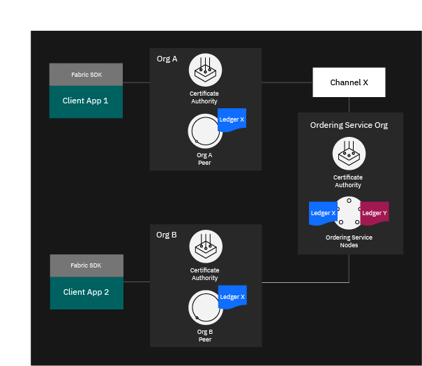

# Fabric Operatons Console

Fabric Operatons Console is ideal for any customers who want to store their data, run their ledger transaction workloads on their own infrastructure. Clients can build, operate, and grow their operation networks with an offering that can be used from development through production.

# Operation Console component overview

The components and structure of the Operation Console are based on the underlying infrastructure and tools of <a href="https://hyperledger-fabric.readthedocs.io/en/latest/" target="_blank">Hyperledger Fabric </a>. Networks based on Fabric include several standard components that can be deployed in a number of configurations to support a wide variety of use cases.

For a more comprehensive overview of Fabric networks and the interrelation of the components that comprise it, see <a href="https://hyperledger-fabric.readthedocs.io/en/latest/network/network.html" target="_blank">this document on the structure of a fabric network </a> from the Fabric community documentation, which shows how a network can be started and matured.

For the purposes of this overview, we focus just on certificate authorities (CAs), orderers, peers, smart contracts, and applications. As you can see from the [build a network tutorial](console-build-network), this sequence is not arbitrary; it reflects the proper order in which components in a network based on Fabric are deployed.

## Peers

At a conceptual level, a fabric network is comprised mainly of organizations (as organizations decide on how a network is structured, as well as owning nodes and managing identities). At a physical level, however, a fabric network is comprised primarily of peer nodes that are owned and administered by organizations. Peers are the fundamental elements of the network because they host ledgers and smart contracts (which are contained in <a href="https://hyperledger-fabric.readthedocs.io/en/latest/developapps/chaincodenamespace.html" target="_blank">"chaincode" </a>), and are therefore where transactions are executed and validated.

More accurately, the peer hosts **instances** of the ledger, and **instances** of smart contracts. Because smart contracts and ledgers are used to encapsulate the shared processes and shared information in a network, these aspects of a peer make them a good starting point to understand what a Fabric network does.

To learn more about peers specifically, check out <a href="https://hyperledger-fabric.readthedocs.io/en/latest/peers/peers.html" target="_blank">peers  </a> from the Fabric community documentation.

The Fabric Operatons Console allows you to create peers, join them to channels, create anchor peers, install smart contracts, and seamlessly upgrade your peers.

## Certificate Authorities (CAs)

You can think of a fabric network as a series of managed interactions between nodes to serve a defined business use case. For these interactions to be verifiable (to ensure, in other words, who is who) requires identities and a system of permissions that can be checked during each interaction. You can think of the kind of identity that is needed as being similar to a credit card in that it identifies someone within a particular context. Credit cards identify an individual in terms of banking transactions, while Fabric identities allow users to be identified in a fabric context.

In Hyperledger Fabric, this component is the Certificate Authority (CA), which creates identities in the form of x509 certificates as well defining of an organization through the creation of a Membership Services Provider (MSP), which defines the permissions of identities at a component and channel level. These identities can include attributes about them, for example, by linking them to a particular organization or organizational unit (OU).

An organization MSP, for example, has an MSP subfolder called **admins**. Any user whose certificate is inside that admin folder is an admin of the organization. Because this MSP defines the organization, it is listed in the configuration on every channel of which the organization is a member. As a result, whenever an admin of the organization tries to perform an action, the signing certificate of the admin (which is attached to all of its interactions) is checked against the certificates listed in the MSP. Does the certificate match the one listed in the channel configuration? If it does, the other organizations will validate it and the action can be performed. If not, the request to execute the transaction is rejected.

Fabric Operatons Console CAs are based on the <a href="https://hyperledger-fabric-ca.readthedocs.io/en/release-1.4/" target="_blank">Hyperledger Fabric CA </a>, though it is possible to use another CA if it uses a PKI based on x.509 certificates. Because non-Fabric CAs are not configured to create properly formatted MSPs, users who want to use this kind of CA must create the MSP for themselves.

For more information about how certificate authorities are used to establish identity and membership, see <a href="https://hyperledger-fabric.readthedocs.io/en/latest/identity/identity.html" target="_blank">Hyperledger Fabric documentation on identity </a> and on <a href="https://hyperledger-fabric.readthedocs.io/en/latest/membership/membership.html" target="_blank">membership </a>.

## Ordering services

Hyperledger Fabric features a kind of a node that relies on deterministic consensus algorithms that is called an “ordering node” or an "orderer", that does this transaction ordering. The collection of ordering nodes form the "ordering service".

In addition to promoting finality, separating the endorsement of smart contract execution (which happens at the peers) from ordering gives Fabric advantages in performance and scalability, eliminating bottlenecks that can occur when execution and ordering are performed by the same nodes.

The ordering service performs one other key function: it maintains what is known as the "system channel", a default channel that hosts the "consortium", the list of organizations that can create and join application channels. Because some aspects of the configuration of application channels are inherited by default from the system channel (certain capability levels, for example), it is the job of ordering service admins to establish these defaults. Note however that the ordering service organization can add additional administrating organizations to the system channel.

The Fabric Operatons Console uses an implementation of the Raft protocol, in which a leader node is dynamically elected among the ordering nodes in a channel (this collection of nodes is known as the “consenter set”), and that leader replicates messages to the follower nodes. Because the system can sustain the loss of nodes, including leader nodes, as long as there is a majority of ordering nodes (what’s known as a “quorum”) remaining, Raft is said to be “crash fault tolerant” (CFT). In the Fabric Operatons Console, users have the ability to select a single node ordering service or a five node ordering service, though it is possible to add or remove nodes from an ordering service and from channels later on. Similarly, it is possible for either one organization or multiple organizations to manage the ordering service and contribute nodes.

For more information about the ordering service, see <a href="https://hyperledger-fabric.readthedocs.io/en/latest/orderer/ordering_service.html" target="_blank">the Ordering Service </a>.

## Channels

A channel is a mechanism that provides a private layer of communication, allowing subsets of network members to create a separate ledger for their transactions. Channels are not just **private** in the sense that network members who are not a part of the channel are unable see the transactions, they are also **secret** in the sense that unless a network member is a part of the channel, they will not even know that the channel exists.

As discussed in the section on [peers](#peers), data in a fabric network is stored on peers in a ledger. Each channel has a separate ledger that holds the transactions (which include configuration transactions) for that channel.

The Fabric Operatons Console allows channels to be easily created and managed. Channel configuration updates allow the members of a channel to edit channel parameters to fit their use case. For example, more members can be added to a channel, or the capabilities of a channel can be changed. Because changes to a channel must be approved by channel members, the Fabric Operatons Console provides a mechanism for the collection of necessary signatures.

For more information about channels and how to use them, see the <a href="https://hyperledger-fabric.readthedocs.io/en/latest/channels.html" target="_blank">Hyperledger Fabric documentation </a>.

## Smart contracts

Before businesses can transact with each other, a common understanding about rules and processes must be reached and defined. Taken together, these contracts lay out the "business model" that governs all of the interactions between business partners.

The same need exists in fabric networks. The industry term for these business models on fabric networks is "smart contracts". Fabric networks contain these contracts in a larger structure that is known as "chaincode", which includes not just the business logic but the underlying infrastructure that validates the identities of the users that attempt to invoke the smart contract.

Where contracts in the business world are signed and filed with law firms, smart contracts are installed on peers and deployed on a channel.

See <a href="https://hyperledger-fabric.readthedocs.io/en/latest/smartcontract/smartcontract.html" target="_blank">smart contracts </a> for more information.

## Applications

Client applications in a Fabric-based network like Fabric Operatons Console leverage underlying infrastructures such as APIs, SDKs, and smart contracts to allow client interactions (invokes and queries) at a higher level of abstraction.

For a look at how applications interact with a network based on Fabric, check out the <a href="https://hyperledger-fabric.readthedocs.io/en/latest/developapps/developing_applications.html" target="_blank">developing applications </a> topic in the Hyperledger Fabric documentation.

## An example network

**Figure 1** depicts an example of a deployed fabric network that consists of two organizations, Org A, and Org B. Each organization has their own Certificate Authority that is responsible for distributing cryptographic identity material. There is also an ordering service with five Raft nodes that defines policies and network participants. Lastly, client applications in possession of a properly signed x509 certificate can send calls to their associated peers on the network.

 <em>Figure 1. An example fabric network with two members that leverage channels to isolate data.</em>

