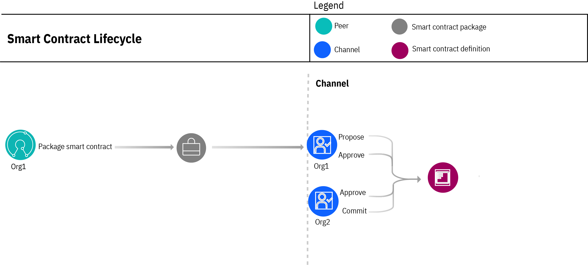
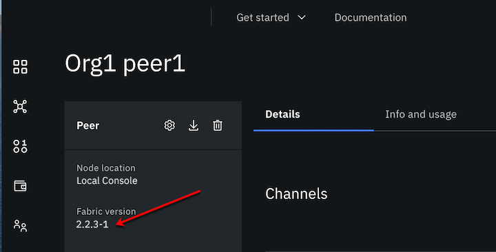
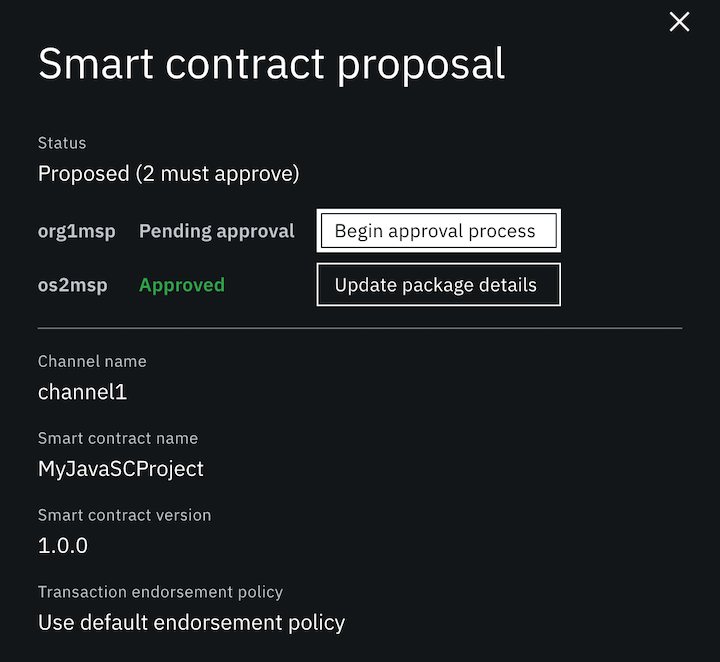
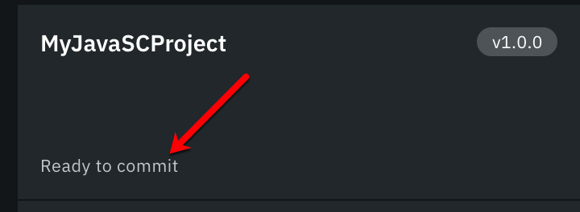

# Deploy a smart contract using Fabric v2.x

Using the **Hyperledger Fabric v2.x chaincode lifecycle** to learn how to create and package a smart contract and how to propose the smart contract definition to channel members on a channel that runs `application capability 2.x`. Learn how to install the smart contract package on peers that run a Fabric 2.x image. Finally, see how channel members can approve and commit the smart contract definition to the channel.

>**_IMPORTANT:_** While the terms "smart contract" and "chaincode" are often used interchangeably, "smart contracts" refers to the business logic that governs transactions and access to its data, while "chaincode" refers to the larger infrastructure of packages and other code that encompasses a smart contract.

Instead of a single organization administrator making decisions for all organizations about when a smart contract is updated, what it contains, and where it runs, Fabric v2.0 introduced a new distributed process to manage the lifecycle of a smart contract that allows for decentralizing the governance of smart contracts on a channel. The process for installing, proposing, and updating a smart contract is known as the "lifecycle" of a smart contract. This lifecycle is necessarily ongoing, as it encompasses changes to the smart contract itself as well as updates to a channel, as for example when a new member starts using the smart contract, and is managed through a combination of processes inside and outside the console.

**Lifecycle process overview**  

<p style="text-align:center"><br><em>Figure 1. Smart contract lifecycle.</em></p>


The diagram illustrates the smart contract lifecycle process. Org1 begins the process by packaging the smart contract using the Fabric <a href="https://hyperledger-fabric.readthedocs.io/en/v2.2.0/commands/peerlifecycle.html" target="_blank">peer CLI </a>. After packaging, all smart contract lifecycle management is performed from the **Channels** tab in the console.  Org1 proposes the smart contract definition to the channel and installs it on one or more Org1 peers. The smart contract definition includes the definition name, version, endorsement policy, and optionally, private data collections. As a proposer of the definition, Org1 attaches the smart contract _package_, which contains the agreed to business logic that updates the ledger. The package can be shared with the channel members out of band, who can review the source code. However, it's important to understand that channel members **approve the smart contract definition, not the package**. Because Org1 is proposing the smart contract definition, their approval is automatically submitted with the proposal. The other three organizations can approve or abstain. When channel members approve a smart contract definition, they are not required to install the package on their peers. They have three options:
- Simply approve the definition.
- Approve the definition and install the package on one or more of their peers.
- Approve the definition and upload their own package, as long as it does not change any agreed to business logic.  

In the diagram, Org2 approves the smart contract definition. After the approval that isspecified in the channel lifecycle endorsement policy is satisfied, any channel member that has approved the definition can commit it to the channel (only one channel member needs to perform the action). In this case, Org2 submits the commit transaction. 

For more information about advanced channel options, which includes setting the lifecycle policy for the channel and the default endorsement policy that will be set for a smart contract if none is specified, check out the [advanced options](../using_console/console-advanced-channel.md#advanced-options) section of our topic on channels.

## Before you begin

### Ensure peer is running Fabric v2.x image

As a reminder, to leverage the smart contract lifecycle process, the peers on the channel must be running a Fabric v2.x image. The Fabric level of a peer is visible in the console by clicking a peer node to open it.
 <p style="text-align:center"><br><em>Figure 1. How to find the Fabric version of the peer.</em></p>


### Update MSPs in consortium to add organization-level endorsement policy

To use the 2.x smart contract lifecycle, an organization must have an endorsement policy defined. If any organization in the consortium (the list of organizations maintained by the ordering service that are allowed to create channels) do not have an endorsement policy defined, a warning message will appear on the **Details** page of the ordering service with a list of organization MSPs that must be updated.

The best practice to add this endorsement policy to the MSP is to delete the MSP from the system channel and then re-add the MSP. The console detects the fact that the MSP does not contain the endorsement policy and automatically adds it. Note that this action can only be completed by an ordering service administrator. You do not need to delete and re-add the MSPs in the configuration of any application channels that have already been created. For these MSPs, the endorsement policy is added as part of the process of deploying the smart contract.

### Create channel and join peers

Because the lifecycle of a smart contract begins by installing the smart contract on a peer that is joined to a channel, you need to create a channel and include the organization members. **The channel must be configured to run with the [Fabric 2.0 application capability](../using_console/console-advanced-channel.md#capabilities-in-application-channels) level**. Second, you need to deploy at least one peer (that must be running the Fabric v2.x image) for your organization and join it to the channel. If you haven't already created a channel and joined at least one peer to it, see the [build a network](../getting_started/console-build-network.md#the-structure-of-this-network) tutorial for instructions.

>**_IMPORTANT:_** If you are creating a **new** channel, ensure that you select **Advanced channel configuration** so that you have the opportunity to specify the Channel Application Capability 2.0.0 or higher.


### Export and Import Membership Service Providers (MSPs)

A benefit of the decentralized nature of smart contract lifecycle governance is that channel members can agree upon which organizations on the channel and how many of them are required to approve a smart contract definition before it can be committed to a channel. This agreement is described in the channel "lifecycle endorsement policy" when the channel is created. Because an approval notification is sent to each organization in the policy, the console requires the endpoint address of each organization, which happens to be included in their MSP. Therefore, each organization that is specified in the lifecycle endorsement policy must **export** their MSP and send it to the other members in the policy. And then each member must **import** the MSP from each organization into their console. These import and exports steps should have already happened, before the organization peers joined the channel. See [importing a MSP](../using_console/console-import-nodes.md#importing-a-msp) for more details.

### Peer admin identity

Because only peer admin identities are allowed to install a smart contract on a peer, if you plan to  propose a smart contract definition, you need to have the peer admin identity in your console wallet. The peer admin identity is generated when the peer organization MSP is created and it is associated with the peer node during node deployment. If you are unsure, open the peer tile, and in the left column, view the name of the admin identity under **Associated identity for peer**. That is the identity that must be in your wallet and is required when you propose a smart contract definition.

## Limitations

### Can I continue to use the Fabric SDK to deploy my smart contracts?

If your client applications are using the Fabric v1.4 SDK to deploy smart contracts, those functions will no longer work when the peers are running on a channel with the Fabric 2.0 application capability enabled. In this case, you can only use the Fabric v1.4 or v2.x SDKs with the Fabric  Operatons Console to submit transactions or queries against smart contracts. The **SDKs cannot be used to submit administrative transactions such as installing a smart contract, proposing a smart contract definition, approving it, or committing it to a channel.** Instead, customers can use the console UI, the <a href="https://hyperledger-fabric.readthedocs.io/en/release-2.2/commands/peerlifecycle.html" target="_blank">Fabric CLI </a> to perform these administrative tasks.

### What happens to my existing smart contracts?

Although support for Fabric 2.0 networks was added to the platform, you can still run your existing smart contracts on your peers that run a v1.4 image on a channel with an application capability level of 1.4 or lower. Should you later decide to upgrade your peer to a v2.x image and update your channel application capability level to 2.0, **you may need to update your existing smart contract**. However, after you upgrade your peer image to v2.x and channel application capability v2.x, there is no longer a way to update the original smart contract. Instead, when an update is required, you need to repackage the smart contract in the new `.tar.gz` or `.tgz` format using v2 of the VS Code extension and then propose the definition to the channel using the new smart contract lifecycle process.  

Review the following considerations:  

**Node**  

If your smart contract was written in Node, then you might need to update it. By default, a Fabric v1.4 peer will create a Node v8 runtime, and a Fabric v2.x peer creates a Node v12 runtime. In order for a smart contract to work with Node v12 runtime, the `fabric-contract-api` and `fabric-shim` node modules must be at v1.4.5 or greater. If you are using a smart contract that was originally written to work with Fabric 1.4, update the Node modules by running the following command before deploying the smart contract on a Fabric v2.x peer.  See <a href="https://github.com/hyperledger/fabric-chaincode-node/blob/main/COMPATIBILITY.md" target=_blank">Support and compatibility for fabric-chaincode-node </a> for more information.
```
npm install --save fabric-contract-api@latest-1.4 fabric-shim@latest-1.4
```


**Go**  

Because Fabric v2.x peers do not have a "shim" (the external dependencies that allowed smart contracts to run on earlier versions of Fabric), you need to vendor the shim and then repackage any smart contracts written in Golang (Go) that use the <a href="https://github.com/hyperledger/fabric-sdk-go" target="_blank">Go SDK </a>. "Vendoring the shim"  effectively means that you are copying the dependencies into your project. Without this vendoring and repackaging, the Go smart contract cannot run on a peer using a Fabric 2.x image. This process is not required for smart contracts that are written in Java or Node.js, nor for Go smart contracts that use the <a href="https://github.com/hyperledger/fabric-contract-api-go)" target="_blank">Go contract-api </a>.

**Java**  
The `build.gradle` file for the smart contract must be updated:

1. If the smart contract uses the `shadowjar` 2.x plugin, then it should be updated to version 5 by using the following code:
	```
	plugins {
	    id 'com.github.johnrengelman.shadow' version '5.1.0'
	    id 'java'
	}
	```

2. The `repositories` section of the file must contain the `maven URL` for `jitpack`, for example:
    ```
	  repositories {
	      ...
	      maven {
	        url 'https://jitpack.io'
	      }
	  }
    ```

**Init functions**  

If the smart contract was written using the **low-level APIs** provided by the Fabric Chaincode Shim API, your smart contract needs to contain an `Init` function that is used to initialize the chaincode.  This function is required by the smart contract interface, but does not necessarily need to be invoked by your applications. Because you cannot use the console to deploy a smart contract that contains an `Init` function, you need to move that initialization logic into the smart contract itself and call it separately. For example, the smart contract can use a reserved key to check whether the smart contract has already been initialized or not. If not, then call the initialization logic, otherwise proceed as usual. If your smart contract needs to include the `Init` function, the only way to deploy it is by using the Fabric <a href="https://hyperledger-fabric.readthedocs.io/en/release-2.2/commands/peerlifecycle.html#peer-lifecycle-chaincode-install" target="_blank">peer lifecycle chaincode install </a> command. You can also refer to the <a href="https://hyperledger-fabric.readthedocs.io/en/release-2.2/chaincode_lifecycle.html#step-three-approve-a-chaincode-definition-for-your-organization" target="_blank">Fabric documentation </a> for more details on how to use an `Init` function with the Fabric chaincode lifecycle.

**Repackage smart contract**  

After you have updated your smart contract, you will need to repackage your smart contract into `.tgz` or `tar.gz` format in order to be uploaded to the console.


## Step one: Write and package your smart contract

The Fabric  Operatons Console manages the *deployment* of smart contracts rather than development. If you are interested in developing smart contracts, you can get started with tutorials provided by the Hyperledger Fabric community and tooling provided by {{site.data.keyword.IBM_notm}}.

- To learn how smart contracts can be used to conduct transactions among multiple parties, see the <a href="https://hyperledger-fabric.readthedocs.io/en/release-2.2/developapps/developing_applications.html" target="_blank">developing applications topic </a> in the Hyperledger Fabric documentation.
- For guidance on how to leverage the smart contract lifecycle to satisfy a wider set of business use cases, see [writing powerful smart contracts](../smart_contract/write-powerful-smart-contracts.md).
- For a more in-depth end-to-end tutorial about using an application to interact with smart contracts, see <a href="https://hyperledger-fabric.readthedocs.io/en/release-2.2/tutorial/commercial_paper.html" target="_blank">Hyperledger Fabric Commercial Paper tutorial </a>.
- To learn about how to incorporate access control mechanisms into your smart contract, see <a href="https://hyperledger-fabric.readthedocs.io/en/release-2.2/chaincode4ade.html#chaincode-access-control" target="_blank">writing your first chaincode </a>.

When they are tested and ready to be deployed on the network, smart contracts must be packaged into a `.tgz` or `tar.gz` format in order to be uploaded to the console. Because the smart contract packaging uses the `tar` format, organizations can easily inspect their contents by using widely available tooling. When it is important to review the smart contract package before approving the definition, the package can be shared out of band with organization members. There is no way to share the package from the console. You can use the <a href="https://hyperledger-fabric.readthedocs.io/en/release-2.2/commands/peerlifecycle.html#peer-lifecycle-chaincode-package" target="_blank">peer lifecycle chaincode package </a> CLI to package your smart contract.

>**_TIP:_** Smart contracts in `.cds` format cannot be used with the Fabric 2.0 lifecycle. They need to be repackaged into `.tgz` format. 


### Vendoring smart contracts

If your smart contract uses the
<a href="https://github.com/hyperledger/fabric-chaincode-go/tree/main/shim" target="_blank">fabric-chaincode-go </a> shim or the <a href="https://github.com/hyperledger/fabric-contract-api-go" target="_blank">Go contract-api </a> you need to repackage the smart contract before it can be installed on a peer that is running a Fabric v2.x image.

**Why is vendoring the shim required?**  

In Fabric v1.4.x, the Go chaincode shim and protocol buffers (protos) were included with the Fabric distribution and were included in the Go chaincode runtime in the Fabric  Operatons Console. Starting with v2.0, Fabric now provides the chaincode shim and protos as separate repositories that need to be imported or "vendored" in Go smart contracts before they can be installed on a peer that runs a Fabric v2.x image. To vendor the shim for your Go smart contract, navigate to your smart contract source folder and initialize the Go module by issuing the following command which creates a `go.mod` file:

```
go mod init
```

Add the required imports to `go.mod` by running the following command:
```
go test
```

The `go.mod` file will resemble:
```
module mysmartcontract

 go 1.14

 require (
         github.com/hyperledger/fabric-chaincode-go v0.0.0-20200511190512-bcfeb58dd83a
         github.com/hyperledger/fabric-protos-go v0.0.0-20200506201313-25f6564b9ac4
 )
```
or if you are using the `Go contract-api`, it will resemble:
```
module github.com/hyperledger/fabric-samples/chaincode/fabcar/go

go 1.13

require github.com/hyperledger/fabric-contract-api-go v1.1.0
```

You can then get the necessary dependencies to install the Go smart contract on a 2.x peer by issuing the following command that completes the vendoring of the smart contract:

```
go mod tidy
go mod vendor
```

See the <a href="https://golang.org/ref/mod" target="_blank">go documentation </a> to learn more about what these commands do.  

**Package Construction**  

The following example shows the folder structure of a "marbles" smart contract that uses the fabric-chaincode-go shim before the vendoring process:

```
├── META-INF
│   └── statedb
│       └── couchdb
│           └── indexes
│               └── indexOwner.json
├── marbles_chaincode.go
└── util
    └── util.go
```

And after the vendoring process, the structure is as follows:

```
├── META-INF
│   └── statedb
│       └── couchdb
│           └── indexes
│               └── indexOwner.json
├── go.mod
├── go.sum
├── marbles_chaincode.go
├── util
│   └── util.go
└── vendor
    ├── github.com
    │   ├── golang
    │   │   └── protobuf
    │   └── hyperledger
    │       ├── fabric-chaincode-go
    │       └── fabric-protos-go
    ├── golang.org
    ├── google.golang.org
    └── modules.txt
```
>**_NOTE:_** The source directory must be the smart contract name which is "marbles" in this case. Therefore, the import for the util package in the smart contract would be:  `import "marbles/util"`

After you have completed these steps, you need to repackage your smart contract into `.tgz` or `tar.gz` format in order to be uploaded to the console.

>**_TIP:_** Fabric-contract-api and fabric-shim node modules must be at v1.4.5 or greater to work with Node version 12. If you are using a smart contract that was originally written to work with Fabric 1.4, check the node modules before deploying your smart contract on a peer that runs a Fabric v2.x image.


### Versioning smart contract definition and packages

As a best practice, a smart contract package name should be of the format `[SMART_CONTRACT_NAME]_[VERSION]` where the initial smart contract version would be `1.0.0`, for example:
`MySmartContract_1.0.0`. Before you package your smart contract, you should consider this format for the name to allow for versioning of the package in the future. For more details, review [versioning a smart contract](#versioning-a-smart-contract).

## Step two: Install and Propose smart contract

After packaging a smart contract, its lifecycle on the channel begins by installing the smart contract on your own organization peers and proposing the smart contract definition to the other channel members. You install a smart contract **package** and propose a smart contract **definition**.  

All lifecycle actions are managed from the **Channels** tab in the console.

1. Navigate to the **Channels** tab, open the channel, and click **Propose smart contract definition**. This single action actually performs two tasks. It _installs_ a smart contract on one or more of your peers and _proposes_ the smart contract definition to the channel.

2. Because the console allows you to act as multiple organizations from a single console, you must first select the organization that is proposing this smart contract definition and the associated peer admin identity. A peer admin identity is required to install a smart contract. Not sure? Open the peer CA and verify that the identity associated with the peer has the type `admin` in the list of CA users.

3. On the next panel, browse to your smart contract package and click **Add file**.  You can install a new package or browse to an existing package that was installed on another peer in your organization.
    >**_NOTE:_** Smart contract packages can also be installed on a peer node directly by using the **Install smart contract** button. If you used that option, instead of clicking **Add file**, click the **Existing package** tab and select the package that you installed on your peer.
  
4. On the **Smart contract details** panel you can specify a unique name and version to use for this smart contract definition. The console extracts these values from the package name itself but you can override them and specify any values that your organization prefers.
    >**_TIP:_** Be careful how you name your proposal. If a proposal with the same name already exists on the channel, this proposal replaces it.
  

5. On the **Install smart contract** panel, you can install the smart contract on all your peers on the channel or just a subset. In a production network, for redundancy reasons, you should install the smart contract on at least two peers, or three when you want to maintain redundancy but still allow for one peer to go down for maintenance. If you are installing a smart contract on s390x, you may need to increase the timeout on your peer. 
   >**_NOTE:_** Since you are proposing the smart contract, it must be installed on at least one peer.
  
6. On the **Smart contract endorsement policy** panel, you can designate how many organizations need to endorse a smart contract transaction before it can be committed to the ledger.  The default smart contract endorsement policy is inherited from the application endorsement policy of the channel, but can be overridden here by selecting specific organizations and the required number, or by pasting in your own policy JSON. Remember, this smart contract  endorsement policy becomes part of the proposal that must be agreed to by the other channel members before the smart contract can be committed to the channel. The endorsement policy must follow the format that is specified in the Fabric documentation <a href="https://hyperledger-fabric.readthedocs.io/en/release-2.2/endorsement-policies.html#endorsement-policy-syntax" target="_blank">endorsement policy syntax </a>.

7. If your smart contract includes Fabric private data collections, you need to upload the associated collection configuration JSON file on the **Additional private data collection** panel. Otherwise, you can skip this step. For more information, see [private data](#private-data).

8. Your smart contract proposal definition is listed on the **Summary panel**. Everything that you selected on the previous panels become part of the proposal definition. It also includes the list of organization members that will receive the proposal notification. Once a proposal is created, the definition cannot be modified.
    >**_IMPORTANT:_** Proposal definitions cannot be modified after they are created. If, after creating the proposal you realize that changes are required to the definition, you need to create a new proposal. However, you are permitted to update the package on the proposal.
  

9. When you are satisfied with the proposal, click **Propose** to install the smart contract on the selected peers and send an approval notification to the channel members. When the proposal is successful, it is visible in the **Channels** tab under **Smart contract definitions** with a status of **_Proposed_** on the tile. It is also visible to members of the channel lifecycle endorsement policy under the console Notifications (bell) icon.

    >**_TIP:_** If other organizations will run the package on their peers, you need to share the name of the package with them out of band, so they can select it and install it on their peers when they approve the smart contract definition. The smart contract package name is included on the proposal Summary panel.


## Step three: Approve smart contract definition

The decentralized governance of the smart contract lifecycle requires that the specified number of organizations in the channel lifecycle endorsement policy approve the smart contract definition before it can be committed to a channel. All organizations listed in the channel lifecycle endorsement policy receive a notification when a proposal definition is submitted to the channel. They can access the proposal from the Notification (bell) icon in the console or simply open the **Channels** tab where they can find the smart contract definition tile in the `Proposed` state. Clicking the tile or the notification opens the same approval panel.  

<p style="text-align:center"><br><em>Figure 2. Smart contract approval panel.</em></p>

Proposal originators can view the proposal using the same mechanisms. However, by virtue of submitting the proposal, their approval is automatic.  

**Channel members approve the smart contract definition, not the smart contract package**, which contains the business logic that runs on a peer. A smart contract proposal contains the following information:
- **Smart contract definition name**
- **Version**
- **Smart contract endorsement policy**
- **Private data collection JSON (optional)**

The members, including the originator, cannot change the definition. They can simply approve it or choose not to approve it. If the required approvals based on the channel lifecycle endorsement policy are not met, the smart contract cannot be committed to the channel.  


1. Click **Begin approval process** to get started.

2. Before you can approve a smart proposal, you are required to select your organization and the associated **peer admin identity** that you want to use to approve or endorse the proposal.

3. Channel members can choose among these options:
  - **Approve the definition, but do not install the package on any of their peers.** Useful when the smart contract can run on the channel but is not required for your organization.

  - **Approve the definition and install the package on one or more peers in their organization.** The proposal originator needs to share the package file out of band with the channel members so they can upload it and install it on their peers. Smart contract packages cannot be shared from the console.

  - **Approve the definition but upload their own package and install it on one or more peers in their organization.** When an organization prefers to run their own version of the smart contract package on the channel (provided the read/write set logic is the same), they can upload their own smart contract package file during the approval.

  - **Approve the definition but select an existing package from another peer in their organization.** When an organization prefers to run their own version of the smart contract package on the channel, provided that the read/write set logic is the same, and that package is already installed on another peer in their organization, they can select the existing smart contract package during the approval.

  - **If a member wants to reject the smart contract proposal, they should simply abstain from approving the definition.**  Instead, they can create a new smart contract proposal with the definition they prefer and either upload a new smart contract package or use the existing one from the original proposal. **Note:** The new proposal must use a new smart contract **definition name**.

After you approve a smart contract proposal and while it is waiting for approvals from other members, you can still update the package for your organization, or install it on additional peers if needed. Simply, reopen the proposal tile on the **Channels** tab and click **Update package details** next to your organization to upload a new package.  If you do upload a new package, when you create the updated package, we recommend incrementing the third digit of the version on the package name to help you differentiate the packages. For example, if the existing package is named `MySmartContract@1.0.0.tar.gz`, the new package is named `MySmartContract@1.0.1.tar.gz`.

>**_NOTE:_** The **Begin approval process** or **Update package details** buttons are not visible on the panel when the console user does not have an identity in their wallet for a listed organization.


## Step four: Commit smart contract definition

If you are familiar with the process that Fabric v1.4 used for deploying a smart contract, the commit step is similar to `instantiation`, which makes the smart contract active on the channel so that peers can begin endorsing transactions.  

When enough organizations have _approved_ the smart contract definition according to the channel lifecycle endorsement policy, the status of the definition on the tile changes to **Ready to commit**.

<p style="text-align:center"><br><em>Figure 3. Smart contract definition ready to commit status.</em></p>


All organizations on the channel that received the approval notification can click the tile to see the organizations that have approved the definition and begin the commit process or they can update the package that will run on their peers after the definition is committed.

>**_TIP:_** Unsure what version of the smart contract is currently running on your organization peers? From the **Nodes** tile, open the peer and scroll down to the **Installed smart contracts** table to view the list of smart contracts installed on the peer. Click **Download** from the action menu to inspect the smart contract version.


1. Click **Begin commit process** when you are ready to commit the definition to the channel. After enough approvals have been satisfied according to the channel lifecycle endorsement policy, only one organization has to commit the definition to the channel.
2. You are required to select your organization and the associated **peer admin identity** that you want to use to commit the definition.

When the smart contract definition is successfully committed to the channel, the status on the tile changes to **Committed**.


## How do I?

Based on the preceding steps, the following table provides a summary of the lifecycle actions that are required depending on your goal:

| Task | Instructions |
|--------|----------|
| **Deploy and run a smart contract** on a channel | You need to [package the smart contract](#step-one-write-and-package-your-smart-contract) into `.tgz` or `.tar.gz` format and then [propose](#step-two-install-and-propose-smart-contract) it to the channel. As part of the proposal process you must **install** the package on at least one peer. Organizations who are members of the lifecycle endorsement policy (specified when the channel is created or updated), must [approve](#step-three-approve-smart-contract-definition) the definition. After the channel members specified in the lifecycle endorsement policy approve the definition, any of them can [commit](#step-four-commit-smart-contract-definition) the definition, at which point the smart contract can start to process transactions on the peers. |
|**Install** a smart contract on my peers| If the smart contract has not yet been proposed to the channel, navigate to the **Channels** tab and click **Propose smart contract definition**. See [install and propose a smart contract](#step-two-install-and-propose-smart-contract) for more details.  <br><br>Otherwise, open the smart contract tile on the **Channels** tab. Next to your organization, click **Begin approval process** or **Update package details** (if you have already approved the proposal) and either upload a package or select an existing package to install, then select one or more peers to install it on. <br><br> **Note:** It is still possible to install a smart contract on a peer from the peer tile on the **Nodes** tab. But this only installs the smart contract on the peer, it does not propose it to the channel.   |
| **Propose** a new smart contract definition |  From the **Channels** tab, click **Propose smart contract definition**. As the proposal originator, you are required to either, upload a new smart contract package and install it on at least one peer, or select an existing package from one of your organization peers. Because you are proposing a new smart contract, a smart contract _proposal_ with the same definition name cannot already exist. If it does, it will get replaced by this proposal. |
| **Install a different smart contract package** than what is included in the smart contract proposal | If there are no differences in the agreed to business logic in your smart contract package, you can use your own package instead. From the **Channels** tab, open the smart contract tile and click either **Begin approval process** next to your organization. Click **Add file** to upload your own package or **Existing package** to select a package that is already installed on a peer in your organization. <br><br>**Note:** If the smart contract business logic has changed, you need to submit a new proposal for approval and attach the new smart contract package.  |
| **Update a smart contract _package_** after I submitted the proposal| I submitted the proposal, but need to update the smart contract package. If the agreed to business logic has not changed, from the **Channels** tab, open the smart contract tile and click **Update package details** next to your organization. Click **Add file** to upload a [new version](#versioning-smart-contract-definition-and-packages) of the smart contract.|
| **Approve** a smart contract definition | Open the smart contract tile on the **Channels** tab. Next to your organization, click **Begin approval process**. You are required to select which admin identity from your organization will submit the approval.  <br><br> If you are ready to approve the smart contract but are not ready to install it on your peers at this time, when prompted to upload or select an existing package, simply click **No** to skip this step. A package is not required when you approve a smart contract definition. <br><br> Or, if you want to install the package that the proposal originator included, click **Add file** to upload the smart contract package shared with you by the proposal originator out of band. <br><br> Lastly, you can install your own version of the smart contract, by clicking **Add file** to upload your own package or **Existing package** if the package is already installed on another peer in your organization. <br><br> If you upload or select a new package, you can choose which peers to install it on.|
| **Install the smart contract on additional or newly added peers** after I approved it | Forgot to install the package on a peer? Or perhaps you've added new peers? Open the smart contract tile on the **Channels** tab. Next to your organization, click **Update package details**. If you want to install the same package on the newly added peers, click **Existing package** and browse to the package that you want to install. Otherwise, you can click **Add file** to upload a new package. Then, select which peers to install the package on.|
| **Reject a smart contract proposal** or definition| Fabric does not include an option to reject a smart contract proposal. Rather, you can abstain from approving, which can prevent the proposal from ever satisfying the lifecycle endorsement policy. Or, you can make a new proposal with a new smart contract definition name, and include the terms that you prefer.  |
| **Commit a smart contract** definition | After the proposal has reached the required number of approvals, the status of the proposal on the **Channels** tab changes to **Ready to commit**. Any channel member can click the tile and then click **Commit** to commit the definition to the channel. At that point, the associated smart contract can begin accepting transactions on the peers. |
| **Update a smart contract _definition_ that has been committed** to the channel | All updates to smart contract _definitions_ have to be approved by channel members, according to the channel lifecycle endorsement policy, before they can be committed to the channel. Changes that require approval include: <ul><li>Updates to the **agreed to business logic of the smart contract** that require a new package.</li><li>Updates to the **smart contract endorsement policy**.</li><li>Updates to a **private data collection**.</li></ul> <br><br>**Tip:** If no changes are made to the agreed to business logic, then updates to the smart contract _package_ do not require approval of channel members. See the next task, **Update a smart contract package after the definition is committed to the channel**.  <br><br>To update any of these elements, you have to create a new proposal in order for the update to be approved. You can additionally update the smart contract package but it is not required, for example if you only need to change the endorsement policy.<br><br> **Important:** If the proposal includes a smart contract package that updates the agreed to business logic, all organizations that are part of the smart contract endorsement policy should install that package, or their own version of it, on their peers. Otherwise, after it is committed, the peers that are running the previous version are no longer able to endorse transactions. This could cause transactions not being committed to the ledger because there are not enough endorsements to satisfy the endorsement criteria. <br><br> Because this is an update to an existing smart contract definition, you need to use the same smart contract definition name but it is recommended to increment the version by a second digit. For example, change the version from `1.1` to `1.2`. This second digit version update is a best practice, which signals channel members that this proposal is an update to an existing smart contract definition and requires approval.  |
| **Update a smart contract _package_** after the definition is committed to the channel| Assuming there are no changes to the agreed to business logic, a smart contract package can be updated without approval from channel members. If there is a change to the logic, see the previous task **Update a smart contract definition that has been committed to the channel** for the process. <br><br>From the **Channels** tab, open the smart contract tile and click **Update package details** next to your organization. If you want to install a package that exists on another peer in your organization, select it from the **Existing package** tab. Or, click **Add file** to upload your own [version](../smart_contracts/console-smart-contracts-v2.md#versioning-smart-contract-definition-and-packages) of the smart contract package. Then select the peers to install it on. Since the smart contract definition is committed, the peer can immediately begin to process requests for the updated smart contract.  |
| **Install the smart contract on peers in my organization after it has been committed** | It's possible that you approved a smart contract for the channel, but elected to not install it on any of your peers. Later, you decide you do want to run the package on your peers.  From the **Channels** tab, open the smart contract tile and click **Update package details** next to your organization. If you want to install the existing package, select it from the **Existing package** tab. Or, upload your own version of the smart contract package. Then select the peers to install it on. Since the smart contract definition is committed, the peer can immediately begin to process requests for the smart contract.  |
| **Install the smart contract on additional or new peers** after it is committed to the channel | After the smart contract definition is committed, maybe you need to install the smart contract package on additional peers or newly created peers. From the **Channels** tab, open the smart contract tile and click **Update package details** next to your organization. If you want to install the existing package, select it from the **Existing package** tab. Or, upload your own version of the smart contract package. Then select the peers to install it on. Since the smart contract definition is committed, the peer can immediately begin to process requests for the smart contract.  |
| **Change the smart contract endorsement policy** of a smart contract definition| Because the smart contract endorsement policy of a smart contract is agreed to by members of the channel before the smart contract can be committed to the channel, the endorsement policy cannot be updated without approval of other channel members, as defined in the channel lifecycle endorsement policy. Therefore, if you need to update the endorsement policy of a smart contract proposal or a committed smart contract, then you need to [submit a new proposal](#step-two-install-and-propose-smart-contract) with the updated endorsement policy. **You do not have to update the smart contract package in this case,** but it is required to increment the smart contract version. |
| **Change the lifecycle endorsement policy for the channel** | From the **Channels** tab, click **Channel details** and click the **Settings** icon and then click through to the **Lifecycle endorsement policy** step. |
| **A new organization joins the channel** and wants to approve a smart contract proposal. | From the **Channels** tab, click the tile of the proposed smart contract and click **Begin approval process**. After providing the identity from your wallet, click **Add file** to upload the package or **Existing package** to select a package already installed on another peer in your organization, and optionally choose which peers to install it on. |
| **A new organization joins the channel** and wants their peers to be able to endorse transactions for a committed smart contract. |From the **Channels** tab, click the tile of the committed smart contract and click **Begin approval process**. After providing the identity from your wallet, click **Add file** to upload the package or **Existing package** to select a package that is already installed on another peer in your organization, and optionally choose which peers to install it on. | |
<p style="text-align:center"><em>Table 2. Frequent smart contract tasks</em></p>

More details on the lifecycle deployment scenarios are available in the <a href="https://hyperledger-fabric.readthedocs.io/en/release-2.2/chaincode_lifecycle.html?highlight=Fabric%20chaincode%20lifecycle#deployment-scenarios" target="_blank">Fabric documentation </a>

## Specifying a smart contract endorsement policy

Every smart contract must have a smart contract endorsement policy, that is specified during the smart contract definition. The endorsement policy specifies the set of organizations, the peers, on a channel that can execute the smart contract and independently validate the transaction output. For example, an endorsement policy can specify that a transaction is added to the ledger only if a majority of the members on the channel endorse the transaction. The organization that proposes the definition can select from among the members who have installed the smart contract to become validators, and sets the endorsement policy for all channel members. You can update your endorsement policy by following the steps for [updating your smart contract](#versioning-a-smart-contract).

When you follow the steps to [propose a smart contract definition](#step-two-install-and-propose-smart-contract), you can use the side panel to specify a contract's endorsement policy after selecting the smart contract package. You have the option to select the default endorsement policy inherited from the channel configuration or to select specific organizations that have to endorse the transactions as well as how many endorsements are required. For information about setting a default endorsement policy for a channel, check out the [advanced options](../using_console/console-advanced-channel.md#capabilities-in-application-channels) section of our topic on channels.

Click the **Advanced** tab if you want to specify a custom policy in JSON format. Use this method when you need to specify more complicated endorsement policies, such as requiring that a certain member of the channel must validate a transaction, along with a majority of other members. You can more information about the required format in the <a href="https://hyperledger-fabric.readthedocs.io/en/release-2.2/endorsement-policies.html#endorsement-policy-syntax" target="_blank">endorsement policy syntax </a>.

Endorsement policies are not updated automatically when new organizations join the channel and install a smart contract. For example, if the endorsement policy requires two of five organizations to endorse a transaction, the policy will not be updated to require two out of six organizations when a new organization joins the channel. Instead, the new organization will not be listed on the policy, and they will not be able to endorse transactions. You can add another organization to an endorsement policy by submitting a new proposal to update the smart contract endorsement policy that can be approved by the organizations that are listed in the channel lifecycle endorsement policy.

### What does the user type have to do with the smart contract endorsement policy?

It's worth clicking the **Advanced** button to review the endorsement policy that will be used for the smart contract. Every organization that you select from the **Members** drop-down list on this panel will be included in the endorsement policy (represented by the role `mspId` parameter in the policy). The value of the role `name` parameter indicates the type of identity that is required to endorse transactions and can be any of  `client`, `peer`, `orderer`, `admin`, or `member`.  If it is set to `member`, then any of the other four roles will satisfy the criteria.

When a `peer` role is specified, you should ensure that any peers that will be submitting endorsement transactions were registered with the correct type. In the following endorsement policy example, peers who are members of `org1msp` can endorse transactions if their enroll id was registered with the type of `client`, `peer`, `orderer`, or `admin`. However, for peers who are members of `org2msp`, their enroll id must have been registered with a type of `peer` to be able to endorse transactions. The `OutOf` expression indicates that 1 out of the 2 organizations must endorse the transaction.

```
OutOf(1, 'org1msp.member', 'org2msp.peer')
```  

Unsure which `type` was selected when a peer identity was registered? From the console, you can open the CA where the peer identity was registered and view the list of registered users and their associated type.

## Versioning a smart contract

It is likely that you will need to modify the smart contract over time as channel members agree to changes in the business logic. Or, your organization may prefer to implement certain aspects of the logic according to your business needs. Regardless, the platform recommends using the following convention:

In order to facilitate the smart contract img process, _package_ naming should be of the format:  
`[SMART_CONTRACT_NAME]_[VERSION]`

where`[VERSION]` contains:
 - `n.n` when the version requires approval across organizations in the channel. For example,  `mysmartcontract_1.0`.
 - `n.n.n` when the version does not require approval from other organizations on a channel. For example,  `mysmartcontract_1.0.1`. Note that this updated version of the smart contract package cannot introduce any modifications the to read/write set that could cause transaction endorsement to fail.  Use this option to incrementally patch your smart contract as needed. This means organizations can roll out minor fixes, for example slight variations such as error checking, to the smart contract independent of other organizations. The important thing is that always, the smart contract must implement the same reads and the same writes to the ledger across all organizations.

    >**_IMPORTANT:_** Although this recommended convention is not enforced by Fabric, it provides a standard nomenclature for you to update the smart contract on your organization's peers without requiring approval from other channel members.  

Organizations on the channel can share their smart contract packages with other channel members, out of band, or each organization can package their own version of the smart contract. But every organization needs to install a package with the same business logic, to allow transaction endorsement to succeed across all peers on the channel. Each organization needs to ensure that the smart contract transactions are deterministic. That is, each transaction must always generate the same transaction response for a given set of transaction inputs. That's because the smart contract is run by multiple organizations, each of whom must generate the same transaction response. If not, the resulting generated transaction will be captured in the ledger as invalid, the world state is not updated, and the transaction has no effect on the ledger.  

Finally, it is important to recognize that in addition to a smart contract package version, each smart contract definition on the channel has its own version as well. 


## Important considerations when you update smart contracts

1. What happens to my peers if I forget to upgrade them to the latest version before committing the smart contract definition on the channel?  

    After updating a smart contract definition to use a use smart contract package and committing it to the channel, if there are still peers on the channel running the previous version, those peers are no longer able to endorse transactions for the smart contract. Also, you risk not having enough endorsements for transactions to be committed to the ledger, depending on how the smart contract endorsement policy is defined. However, it is possible to install the new version of the smart contract package on these peers after the smart contract definition is committed to the channel and the peers will again be able to endorse transactions, effectively catching up.

2. What happens when I remove an organization from my private data collection?

   The peers in that organization continue to store data in the private data collection until its ledger reaches the block that removes its membership from the collection. After that occurs, the peers will not receive private data in any future transactions, and _clients_ of that organization will no longer be able to query the private data via a smart contract from any peer.

3. What happens to the existing `chaincode-execution` pod after I update my smart contract?

    Whenever a transaction is submitted to a smart contract installed on peer, a `chaincode-execution` pod is launched if one does not already exist. When you deploy a new version of your smart contract, the `chaincode-execution` pod for the previous version of the smart contract continues to run but is no longer required. To save cluster resources, you can manually delete the `chaincode-execution` pods for the prior smart contract versions. From your cluster namespace, run the following command to see the list of `chaincode-execution` pods that are currently running:
    ```
    kubectl get pod -n <NAMESPACE> | grep chaincode-execution | cut -d" " -f1 | xargs -I {} kubectl get po {} -n <NAMESPACE> --show-labels
    ```
    

    Replace `<NAMESPACE>` with the name of your cluster namespace. Your smart contract name and version is visible in the output under the `LABELS` column next to `chaincode-id`. To delete the pod, run the following command:

    ```
    kubectl delete pod <CHAINCODE-EXECUTION-POD> -n <NAMESPACE>
    ```
    
    Replace `<CHAINCODE-EXECUTION-POD>` with the name of the `chaincode-execution` pod for the prior version of the smart contract that is visible in the output of the previous command.

## Private data

Private data is a feature of Hyperledger Fabric networks at version 1.2 or higher and is used to keep sensitive information private from other organization members **on a channel**. Data privacy is achieved by using <a href="https://hyperledger-fabric.readthedocs.io/en/release-2.2/private-data/private-data.html#what-is-a-private-data-collection" target="_blank">private data collections </a>. For example, several wholesalers and a set of farmers might be joined to a single channel. If a farmer and a wholesaler want to transact privately, they can create a channel for this purpose. But they can also decide to create a private data collection on the smart contract that governs their business interactions to maintain privacy over sensitive aspects of the sale, such as the price, without having to create a secondary channel. To learn more about when to use private data, visit the <a href="https://hyperledger-fabric.readthedocs.io/en/release-2.2/private-data/private-data.html#private-data" target="_blank">private data </a> concept article in the Fabric documentation.

In order to use private data with Fabric  Operatons Console, the following three conditions must be satisfied:  
1. **Define the private data collection.** A private data collection file can be added to your smart contract. Then, at run time, your client application can use private data-specific chaincode APIs to input and retrieve data from the collection. For more information about how to use private data collections with your smart contract, see the Fabric <a href="https://hyperledger-fabric.readthedocs.io/en/release-2.2/secured_asset_transfer/secured_private_asset_transfer_tutorial.html" target="_blank">secured asset transfer in Fabric </a>
2. **Install, propose, approve and commit.** After you define the smart contract private data collection, you need to use the smart contract lifecycle process to install the smart contract package along with its private data collection on your organization peers.
3. **Configure anchor peers.** Because cross-organizational <a href="https://hyperledger-fabric.readthedocs.io/en/release-2.2/gossip.html" target="_blank">gossip </a> must be enabled for private data to work, an anchor peer must exist for each organization in the collection definition. Refer to this information for [how to configure anchor peers](#console-advanced-channel.md#anchor-peers) on your network.

Your channel is now configured to use private data.

## Implicit data collections

Along with the new chaincode lifecycle, Fabric v2.0 introduced the support for "implicit data collections".  Whereas private data collections keep ledger data private among selected organization members, implicit data collections eliminate the need to define a collection when only a per-organization collection is required. Each organization on the channel has a private data collection that their own organization peers can use. This collection is implicit, because unlike private data collections, it does not need to be explicitly defined when a smart contract is deployed. To take advantage of this capability, the channel must be configured with application capability v2.x and the peers on the channel must be deployed with a Fabric v2.x image.  To learn more about the capability, see <a href="https://hyperledger-fabric.readthedocs.io/en/v2.2.0/private-data-arch.html#referencing-implicit-collections-from-chaincode" target="_blank">referencing implicit collections from chaincode </a>. To learn how to implement this capability in a smart contract, see the <a href="https://github.com/hyperledger/fabric-samples/tree/master/asset-transfer-secured-agreement" target="_blank">secured asset transfer </a> sample.
