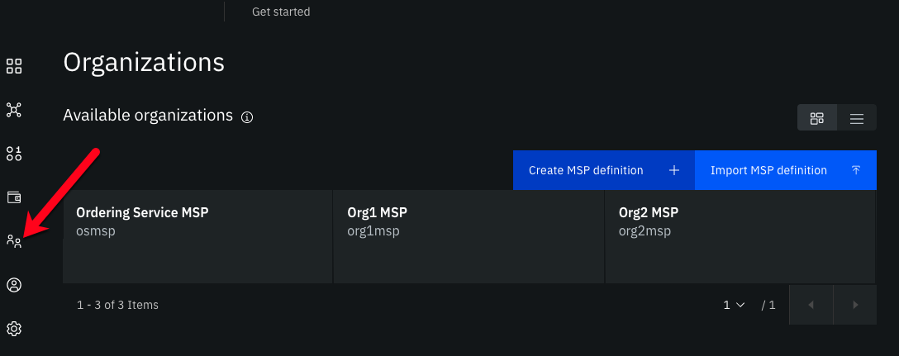
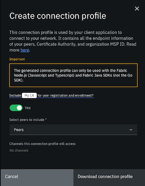
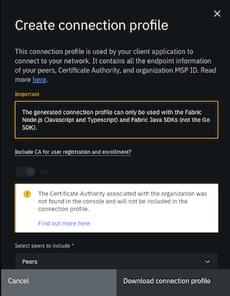
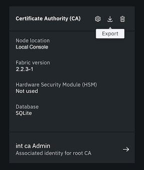

# Managing organizations

You can use the Fabric Operatons Console to create a formal organization definition that is known as a Membership Services Provider (MSP). Your organization's MSP definition allows other members of the fabric consortium to verify the identity of your nodes and applications. Your MSP definition also contains your organization's admin certificates.

You can also use the console to manage which organizations are members of your channel. The administrator of the ordering service can use the organizations tab to add members to the console consortium. Members of the channel can then use the console to add members to new or existing channels.

>**_TIP:_** A consortium is the group of non-orderer organizations listed on the orderer system channel. These are the only organizations that can create channels. At channel creation time, all organizations added to the channel must be part of a consortium. However, an organization that is not defined in a consortium may be added to an existing channel. While a Fabric Operatons Console network can have multiple consortia, most Fabric Operatons Console networks have a single consortium.

<p style="text-align:center"><br><em>Figure 1. Fabric Operatons Console organizations tab</em></p>


**Target audience:** This topic is designed for network operators who are responsible for creating, monitoring, and managing the fabric network.

## Understanding MSPs

The Fabric Operatons Console is based on Hyperledger Fabric. Participants need to be known to the network before they can submit transactions and interact with the assets on the ledger. Fabric recognizes identity through a group of invited organizations at the channel level. Organizations in the consortium are able to issue valid credentials to their members and let them become participants in the network. The participants can then operate fabric nodes and submit transactions from client applications.

Each organization in a network needs to operate a Certificate Authority to create all of the identities for the admins and nodes that belong to your organization. These public-private keys pairs are issued by the CA and used by the members of your organization to sign and verify their actions. When an organization joins a channel, the public key of the CA associated with that organization allows other organizations to verify that your peers and applications are valid participants. For more information about membership in Hyperledger Fabric, see the <a href="https://hyperledger-fabric.readthedocs.io/en/latest/membership/membership.html" target="_blank">Membership Service Provider </a> in the Fabric documentation.

Before your organization can join a consortium, it needs to create an organization definition that is known as a **Membership Services Provider (MSP)**. The MSP contains the following information:
- A certificate signed by your **root Certificate Authority**. This certificate is used to verify the identity of your nodes, channels, and applications.
- A certificate signed by your **TLS CA**. A root TLS certificate allows your peers to participate in cross organization gossip (A protocol for secure, reliable, and scalable communication of information in a network by passing messages among peers), which is necessary to take advantage of the <a href="https://hyperledger-fabric.readthedocs.io/en/latest/private-data/private-data.html#what-is-a-private-data-collection" target=_blank">private data collections </a> and <a href="https://hyperledger-fabric.readthedocs.io/en/latest/discovery-overview.html" target="_blank">service discovery </a> features of Hyperledger Fabric.
- The **MSP ID**. The MSP ID is the formal name of your organization. You need to remember the MSP ID for your applications or when using the SDK to submit transactions.
- The **MSP display name**. This is an informal name that is given to your organization, which is used to identity your MSP in the console.
- The **Admin certificates** of your **Organization Admin** identities. These certificates are passed to the ordering service and are used to verify which identities in your organization are allowed to create or edit channels. When you use your console to create an ordering node or peer, the admin certificates inside the MSP are deployed within the new node, making your organization admin identities your **peer or orderer admins** as well. You can use these identities to operate your node, such as by installing a smart contract on a peer or joining a peer to a channel, from your console or a client application.

## Managing MSPs in the console

Navigate to the **Organizations** tab. You can use this tab to [create an MSP definition](#creating-a-MSP-for-your-organization) by using a Certificate Authority that exists in your console. You can also use this tab to [import a MSP](#importing-a-MSP) that was created by another organization.

You can view all of the MSPs that you created or imported under **Available organizations**. You can use the MSP definitions in the organizations tab for important functions within your console:
- If you are creating peer or ordering nodes, the MSP of your organization is used to identify the organization that the node belongs to.
- MSPs are used by organizations to verify the signatures of actions by other organizations. For this reason, you should export your MSP to every organization in the channel and likewise import the MSP of every organization.
- If your organization is one of the admins of the ordering service, you can [add new organizations to the consortium](#adding-an-organization-to-a-consortium).
- If you are a member of the channel, you can import the MSPs of other organization into your console and then add the members to new or existing channels.

You can click an MSP definition in the organizations tab to view all of the nodes in the console that belong to each organization. Because each node was deployed with the administrator certificate from the MSP definition inside, you can use this panel to know which nodes are managed by which organization administrator.

## Creating a MSP for your organization

Use the **Organizations** tab to generate an MSP definition for your organization. When you click **Create MSP definition**, a panel will open in which you will enter all the necessary information for your MSP.

- The **MSP definition details** tab is where you provide a display name and an MSP ID for the MSP. Use the tooltip to learn about the restrictions for the MSP ID.

        >**_IMPORTANT:_** If your organization is joining an ordering service with other organizations, to avoid confusion, it is strongly recommended that every organization have a unique MSP ID. In other words, you should never use the same MSP ID to represent different organizations on a network.

- The **Root Certificate Authority details** tab is where the CA for your organization is specified. This is the CA that you use to register all of the identities associated for your organization. Before creating an MSP, you must register the admin of the MSP. If you use intermediate CAs, this is the CA that you used to create those CAs. Select your CA from the list of CAs managed by using your console. If you created a CA using the console, selecting a CA will also display the root TLS certificate of your TLS CA, which was deployed alongside your CA.

- You can also use the **Admin certificates** tab to generate the identity of your organization admin. If you already have an admin identity you want to make your organization admin, click **Existing identity** and select the identity from the drop-down list. If you want to use the panel to generate a new admin identity, you need to register your organization admin with your CA. You then need to complete the following steps in order to use these identities to operate your network:

  1. Enter the **Enroll ID** and **Enroll secret** of an admin identity that is registered with your CA. After you enter the enroll ID and enroll secret, choose a **Display name**. This name is used to represent the identity in the console.
  2. Click **Generate**. This generates a certificate and private key and automatically add the keys to your Wallet. You can then find your admin identity in your Wallet by using the name that you selected on this panel. These keys are only stored in your browser local storage. Therefore, if you change browsers, they will not be in your Wallet. This is why you should click **Export** to export this identity to your local file system. If you switch browsers, you will need to import the identity from your file system into the Wallet of your new browser.
  3. Then, click **Export** to download the key pair to your file system and secure them.

- The **Administrators certificate** section of the side panel contains the signing certificates keys of your admins. The certificate that you generated by clicking **Generate** in the section above can be found in the first row of the field. If you want to use multiple admin identities to operate your network, you can paste additional certificates into **admin certificate** fields.

Because your admin certs are passed to your nodes and channels by using the MSP definition, you need to ensure that each of your node and organization admin certificates is stored in the MSP. When you use the console to create an orderer, peer, or channel, you need to **Associate** one of the identities you exported in your Wallet with the admin certificates that were provided to the MSP definition. When you encounter an **Associate identity** section or panel, select an identity that you generated and saved to the Wallet when creating the MSP definition.

- On the **Review MSP information** panel, review the information that you specified for this MSP.

After you have selected your CA, MSP ID, and either specified or created an admin, click **Create MSP definition**. It should now be listed as an organization in the Organizations tab. Because an MSP is the representation of an organization in the network, you select the MSP definition when you deploy your nodes (identifying the organization the node belongs to), are joined to the consortium (by an ordering service admin), create a channel, join a channel, edit a channel, or perform any action where you have to specify the organization that is performing the action.

## Downloading a connection profile

After you create an organization MSP definition and create peers with that organization MSP definition, you can download a connection profile that can be used by a client application to connect to your network via one or more gateway peers. The gateway peers are the peers that are specified in the connection profile, and they are used to perform service discovery to find all of the endorsing peers in the network that will endorse transactions.

Click the **Organization MSP** tile for the organization that your client application interacts with. Click **Create connection profile** to open a side panel where you can build and download your connection profile.

<p style="text-align:center"><br><em>Figure 2. Create connection profile panel</em></p>

If you plan to use the client application to register and enroll users with the organization CA, you need to include the Certificate Authority in the connection profile definition.

Select the peers to include in the connection profile definition. When a peer is not available to process requests from a client application, service discovery ensures that the request is automatically sent to a different peer. Therefore, to accommodate for peer downtime during a maintenance cycle for example, it is recommended that you select more than one peer for redundancy. In addition to peers created by using the console or APIs, imported peers that have been imported into the console are eligible to be selected as well.

The list of channels that the selected peers have joined is also provided for your information. If a channel is missing from the list, it is likely because the peer joined to it is currently unavailable.

You can then download the connection profile to your local file system and use it with your client application to generate certificates and invoke smart contracts.

>**_NOTE:_** The connection profile that is downloaded from the Fabric  Operatons Console can only be used to connect to your network by using the Node.js (JavaScript and TypeScript) and Java Fabric SDKs.

The generated connection profile only supports Fabric CAs. If you manually built your organization MSP with certificates from an external CA, the connection profile will not include any information in the "certificateAuthorities": section.

### Including a certificate authority in a connection profile

If you plan to use a client application to register and enroll users with the organization CA, then you need to include the associated CA in the connection profile.

If the CA that is associated with the MSP resides in a different console, when you attempt to download the connection profile you see a warning message and the ``"certificateAuthorities:"`` section of the generated connection profile is empty.

<p style="text-align:center"><br><em>Figure 3. You can use the organizations panel to create, import, and manage organization MSP definitions.</em></p>

The generated connection profile without the CA information resembles:

```json
{
  "name": "org1profile",
  "description": "Network on Hyerledger Fabric",
  "version": "1.0.0",
  "client": {
      "organization": "org1"
  },
  "organizations": {
      "org1": {
          "mspid": "org1",
          "certificateAuthorities": [
              "xyz-ca.somedomain.com:443"
          ],
          "peers": [
              "ba-peer1.somedomain.com:443",
              "peer1.somedomain.com:443"
          ]
      }
  },
  "peers": {
      "xyz-peer1.somedomain.com:443": {
          "url": "grpcs://xyz-peer1.somedomain.com:443",
          "tlsCACerts": {
              "pem": "-----BEGIN CERTIFICATE-----nnnnnn-----END CERTIFICATE-----\n"
          },
          "grpcOptions": {
              "ssl-target-name-override": "xyz-peer1.somedomain.com"
          }
      },
      "peer1.somedomain.com:443": {
          "url": "grpcs://peer1.somedomain.com:443",
          "tlsCACerts": {
              "pem": "-----BEGIN CERTIFICATE-----nnnnnn-----END CERTIFICATE-----\n"
          },
          "grpcOptions": {
              "ssl-target-name-override": "peer1.somedomain.com:443"
          }
      }
  },
  "certificateAuthorities": {}
}
```

But if the `"certificateAuthorities"` section is empty and client application needs to register and enroll identities with the CA from the connection profile, then you must manually add the CA information to the generated connection profile. To get the CA connection information, simply export the CA, from the console where it resides, to a JSON file:

  1. From the nodes panel, open the CA.
  2. Click the **Export** icon to download the CA configuration to a JSON file.


<p style="text-align:center"><br><em>Figure 4. Click the export icon to download the CA configuration to a JSON file</em></p>

    The downloaded _CA JSON file_ resembles:

    ```
    {
        "display_name": "brian ca",
        "api_url": "https://xyz-ca.somedomain.com:443",
        "operations_url": "https://xyzca-operations.somedomain.com:443",
        "type": "fabric-ca",
        "ca_name": "ca",
        "tlsca_name": "tlsca",
        "tls_cert": "LS0tLS1...bE1UQm1OVGd",
        "name": "brian ca",
        "pem": "LS0tLS1...bE1UQm1OVGd",
        "ca_url": "https://xyz-ca.somedomain.com:443"
    }
    ```

  3. Open the _generated connection profile_ that you downloaded. Edit the `"certificateAuthorities":` section:

    ```
    "certificateAuthorities": {
        "<CA_HOST_PORT>": {
            "url": "<API_URL>",
            "caName": "<CA_NAME>",
            "tlsCACerts": {
                "pem": ["<TLS_CERT>"]
            }
        }
    }
    ```

    Replace:

    - `<CA_HOST_PORT>` with the value of the `"certificateAuthorities":` from the `"organizations":` section of the generated connection profile. For example, `xyz-ca.somedomain.com:443`.
    - `<API_URL>` with the value of the `"api_url"` from the downloaded JSON file.
    - `<CA_NAME>` with the value of the `"ca_name"` from the downloaded JSON file.
    - `<TLS_CERT>` with the value of the `"tls_cert"` from the downloaded JSON file.

If the organization MSP was manually created by using certificates from an external CA, then there is no reason to add the CA to the connection profile. You cannot register and enroll users with an external CA from a client application.

## Updating an organization MSP definition

It is possible that you will need to update an organization MSP definition, such as the display name, or certificates that are included inside the MSP. You can also enable Node OU support on the MSP. Enabling Node OU support is recommended because it greatly simplifies the steps required after certificates are renewed.

>**_IMPORTANT:_** It is recommended that you do not change the `msp_id` field as this might cause breaking changes to your network.

To update your MSP:

- Export the existing MSP definition from the **Organizations** tab and edit the generated JSON file to modify the display name, the existing certificates, or add new certificates.
- Click your MSP definition in the **Organizations** tab to open it and then click the **Settings** icon.
- If the MSP was created in this console and Node OU support is not enabled, the **Node OU** checkbox is selected because you have the opportunity to enable the support now.   If you only want to enable Node OU support on the MSP, you do not need to add a new JSON file, you can go ahead and click **Update MSP definition** now.  This action inserts the `"fabric_node_ous":` section into the JSON along with the appropriate certificates for the organization. Be aware that this action also updates the organization admin certificates on the nodes configured with this MSP definition and each node is restarted to reflect the update.
- (Optional) If you made updates to the MSP JSON definition, click **Add file** to upload the new JSON file.
- Click **Update MSP definition**.
- It is very important to re-export this MSP now and share it with all of the members of the consortium so they can import it into their console and ensure they are using the latest copy of the MSP definition and certificates.  

If you need to add a new admin certificate to an existing organization MSP definition, refer to the topic on [managing certificates](../using_console/console-certificates.md).

## Manually building a MSP JSON file

**This option is for advanced users only who are familiar with how certificates are used in fabric identity management.**

If you prefer to use certificates for your peer or ordering service from an **external CA**, one that is not hosted by {{site.data.keyword.IBM_notm}}, you need to build an MSP definition JSON file that represents the peer or ordering service organization MSP definition.

>**_IMPORTANT:_** Note that all certificates must be encoded in base64 format.

You can convert the contents of your certificate file, `<cert.pem>` from `PEM` format into a base64 string by running the following command on your local machine:

```
export FLAG=$(if [ "$(uname -s)" == "Linux" ]; then echo "-w 0"; else echo "-b 0"; fi)
cat <cert.pem> | base64 $FLAG
```


Create a JSON file by using the following format:

```json
{
    "name": "<organization_name>",
    "display_name": "<organization_name>",
    "msp_id": "<organization_id>",
    "type": "msp",
    "admins": [
        "<admins>"
    ],
    "root_certs": [
        "<root_certs>"
    ],
    "tls_root_certs": [
        "<tls_root_certs>"
    ],
    "fabric_node_ous": {
        "enable": true,
        "admin_ou_identifier": {
            "certificate": "<ou_root_cert>",
            "organizational_unit_identifier": "admin"
        },
        "client_ou_identifier": {
            "certificate": "<ou_root_cert>",
            "organizational_unit_identifier": "client"
        },
        "orderer_ou_identifier": {
            "certificate": "<ou_root_cert>",
            "organizational_unit_identifier": "orderer"
        },
        "peer_ou_identifier": {
            "certificate": "<ou_root_cert>",
            "organizational_unit_identifier": "peer"
        }
    },
    "host_url": "<url>",
}
```

- **organization_name**: Specify any name to be used to identify this MSP definition in the console.
- **organization_id**: Specify an ID that is used to represent this MSP internally in the console.
- **root_certs**: Paste in an array that contains one or more root certificates from the external CA in `base64` format. You must provide either a CA root certificate or an intermediate CA certificate. You can also provide both.
- **admins**: Paste in the signing certificate of the organization admin in `base64` format.
- **tls_root_certs**: Paste in an array that contains one or more root certificates from the TLS CA in `base64` format. You must provide either an external TLS CA root certificate or an external intermediate TLS CA certificate, you can also provide both.
- **ou_root_cert**: Specify the trusted CA root certificate for each role. Typically this value would be the same as the **root_certs**.
- **host_url**: Specify the URL of the fabric console where this MSP will collect signatures.
- **fabric_node_OUs**: Fabric-specific OUs that enable identity classification. `NodeOUs` contain information for how to distinguish clients, peers, and orderers based on their OU. If the check is enforced, by setting Enabled to true, the MSP considers an identity valid only if it is an identity of type `client`, a `peer`, an `admin`, or an `orderer`. An identity should have only one of these special OUs, which are assigned to an identity when it is registered with the CA. See this topic for an example of <a href="https://hyperledger-fabric.readthedocs.io/en/latest/discovery-cli.html#configuration-query" target="_blank">how to specify the `fabric_node_OU` in a MSP </a> in the Fabric Service Discovery documentation. Or learn more about using <a href="https://hyperledger-fabric.readthedocs.io/en/latest/membership/membership.html#node-ou-roles-and-msps" target="_blank">ONode OUs </a> in Fabric.

The following additional fields are also available in your MSP definition but are not required:
- **intermediate_certs**: (if an intermediate CA was used) Paste in an array that contains one or more certificates from the external intermediate CA in `base64` format. You must provide either a CA root certificate or an intermediate CA certificate, you can also provide both.
- **tls_intermediate_certs**: (if an intermediate TLS CA was used) Paste in an array that contains one or more certificates from the intermediate TLS CA in `base64` format. You must provide either an external TLS CA root certificate or an external intermediate TLS CA certificate, you can also provide both.
- **organizational_unit_identifiers**: A list of Organizational Units (OU) that valid members of this MSP should include in their X.509 certificate. This is an optional configuration parameter that is used when multiple organizations leverage the same root of trust and intermediate CAs, and they have reserved an OU field for their members. An organization is often divided up into multiple organizational units (OUs), each of which has a certain set of responsibilities. For example, the ORG1 organization might have both ORG1-MANUFACTURING and ORG1-DISTRIBUTION OUs to reflect these separate lines of business. When a CA issues X.509 certificates, the OU field in the certificate specifies the line of business to which the identity belongs. See this topic in the Fabric documentation on <a href="https://hyperledger-fabric.readthedocs.io/en/latest/msp.html#identity-classification" target="_blank">identity classification </a> for more information.
- **revocation_list**: A list of certificates that are no longer valid. For X.509-based identities, these identifiers are pairs of strings that are known as Subject Key Identifier (SKI) and Authority Key Identifier (AKI), and are checked whenever the X.509 certificate is being used to make sure that the certificate has not been revoked. See this topic in the Fabric documentation for more information about <a href="https://hyperledger-fabric-ca.readthedocs.io/en/release-1.4/users-guide.html?highlight=revocation%20list#revoking-a-certificate-or-identity" target="_blank">certificate revocation lists </a>.

For example, your JSON file would look similar to:

```json
{
    "name": "org1msp",
    "display_name": "org1msp",
    "msp_id": "org1msp",
    "type": "msp",
    "admins": [
        "LS0tLS1CRUdJTiBDRVJUSUZJQ0FURS0tLS0tCk1JSUIzRENDQVlPZ0F3SUJBZ0lVRklDZjhkbFZPbEowazJ1V0RjbEh0MzFJbk1Fd0NnWUlLb1pJemowRUF3SXcKV2pFTE1Ba0dBMVVFQmhNQ1ZWTXhGekFWQmdOVkJBZ1REazV2Y25Sb0lFTmhjbTlzYVc1aE1SUXdFZ1lEVlFRSwpFd3RJZVhCbGNteGxaR2RsY2pFUE1BMEdBMVVFQ3hNR1JtRmljbWxqTVFzd0NRWURWUVFERXdKallUQWVGdzB5Ck1EQTFNVGt5TVRBNE1EQmFGdzB5TVRBMU1Ua3lNVEV6TURCYU1DRXhEekFOQmdOVkJBc1RCbU5zYVdWdWRERU8KTUF3R0ExVUVBeE1GWVdSdGFXNHdXVEFUQmdjcWhrak9QUUlCQmdncWhrak9QUU1CQndOQ0FBVFhRc3puMzVVdwpNaDl3ZHNVSTgwNWo0T2cvdUo0OXBza3VDU3RhNXI0R3NaSlNMYW1jdzlZY0RXcDRNMnVkbzFFdzQzQXAwbjgvCksxOHg3MTd4c3J3RW8yQXdYakFPQmdOVkhROEJBZjhFQkFNQ0I0QXdEQVlEVlIwVEFRSC9CQUl3QURBZEJnTlYKSFE0RUZnUVUxQ3cwUDdlNk13aDh6T1k1NmdnaE9zbVNyd2d3SHdZRFZSMGpCQmd3Rm9BVWwvNkpmck0xVXRjbQp6cFJzRTFNWEVieVovcVF3Q2dZSUtvWkl6ajBFQXdJRFJ3QXdSQUlnRWs3aEJMQ21pZDlZSGpzTk5QSFdlZFF2Cm5tU1hsS3VWUWQ4b3kwc3pLaFlDSUdjY083R0JBWVVFL1BaaUw4Unk4QTRPL3RCZVlQN1J5WENxZU44ZmE1T1gKLS0tLS1FTkQgQ0VSVElGSUNBVEUtLS0tLQo="
    ],
    "root_certs": [
        "LS0tLS1CRUdJTiBDRVJUSUZJQ0FURS0tLS0tCk1JSUNDVENDQWErZ0F3SUJBZ0lVZityblZxMG93WXBIemhXQzBudEJVTnJhS1NJd0NnWUlLb1pJemowRUF3SXcKV2pFTE1Ba0dBMVVFQmhNQ1ZWTXhGekFWQmdOVkJBZ1REazV2Y25Sb0lFTmhjbTlzYVc1aE1SUXdFZ1lEVlFRSwpFd3RJZVhCbGNteGxaR2RsY2pFUE1BMEdBMVVFQ3hNR1JtRmljbWxqTVFzd0NRWURWUVFERXdKallUQWVGdzB5Ck1EQTFNVGt4T0RJMU1EQmFGdzB6TlRBMU1UWXhPREkxTURCYU1Gb3hDekFKQmdOVkJBWVRBbFZUTVJjd0ZRWUQKVlFRSUV3NU9iM0owYUNCRFlYSnZiR2x1WVRFVU1CSUdBMVVFQ2hNTFNIbHdaWEpzWldSblpYSXhEekFOQmdOVgpCQXNUQmtaaFluSnBZekVMTUFrR0ExVUVBeE1DWTJFd1dUQVRCZ2NxaGtqT1BRSUJCZ2dxaGtqT1BRTUJCd05DCkFBU3VWQ0tqUk5nWndpanZoWjJiMStxZjZjbmE5ZWxrazFFbGl4akVXQ0l2bE9jZFUyOUpYNFdzTGcwOXdaa0EKUmdmL2tRZVpLMXdxbWRuV2xxYTl6L1VkbzFNd1VUQU9CZ05WSFE4QkFmOEVCQU1DQVFZd0R3WURWUjBUQVFILwpCQVV3QXdFQi96QWRCZ05WSFE0RUZnUVVsLzZKZnJNMVV0Y216cFJzRTFNWEVieVovcVF3RHdZRFZSMFJCQWd3CkJvY0Vmd0FBQVRBS0JnZ3Foa2pPUFFRREFnTklBREJGQWlFQXZEcVhkN3JjSnV2TDBPcGZvZ0lRVmpZMDVoTHgKSno2NzVOYjhUc2VFc2NFQ0lBUWZpeHFxVmpVUU1hNnh5Qld1QUNXOHUzQjdzNlhNYnNKTUVKVFVoSE1PCi0tLS0tRU5EIENFUlRJRklDQVRFLS0tLS0K"
    ],
    "intermediate_certs": [],
    "tls_root_certs": [
        "LS0tLS1CRUdJTiBDRVJUSUZJQ0FURS0tLS0tCk1JSUIvakNDQWFTZ0F3SUJBZ0lVUjY0d3MrbEkwVndjR3IxdWY0RDF2K3ZXc2gwd0NnWUlLb1pJemowRUF3SXcKWFRFTE1Ba0dBMVVFQmhNQ1ZWTXhGekFWQmdOVkJBZ1REazV2Y25Sb0lFTmhjbTlzYVc1aE1SUXdFZ1lEVlFRSwpFd3RJZVhCbGNteGxaR2RsY2pFUE1BMEdBMVVFQ3hNR1JtRmljbWxqTVE0d0RBWURWUVFERXdWMGJITmpZVEFlCkZ3MHlNREExTVRreE9ESTFNREJhRncwek5UQTFNVFl4T0RJMU1EQmFNRjB4Q3pBSkJnTlZCQVlUQWxWVE1SY3cKRlFZRFZRUUlFdzVPYjNKMGFDQkRZWEp2YkdsdVlURVVNQklHQTFVRUNoTUxTSGx3WlhKc1pXUm5aWEl4RHpBTgpCZ05WQkFzVEJrWmhZbkpwWXpFT01Bd0dBMVVFQXhNRmRHeHpZMkV3V1RBVEJnY3Foa2pPUFFJQkJnZ3Foa2pPClBRTUJCd05DQUFSdHpyOFRpMlh5WENSc1ljbXFPVW5GSDdnVUpnWFBSS3dpUjBVN2N4eHJoU2lYcTh1UTJpanIKRkdhMk95SVhtUVJBbmZUMElIaW5iS29qMmlJL00vc3dvMEl3UURBT0JnTlZIUThCQWY4RUJBTUNBUVl3RHdZRApWUjBUQVFIL0JBVXdBd0VCL3pBZEJnTlZIUTRFRmdRVXFyNDN6dWRjVUpOeVF0TkNOSlIvMGdUdnRJd3dDZ1lJCktvWkl6ajBFQXdJRFNBQXdSUUloQU9hSTBKbVkvNW1Cb080ZTM3QWUrNkxyTXRzR3NqdERXakNnZk5aNzVRRCsKQWlCUmdDSDA3RVJlUkMrRGhlN3BLUkdCVlUvenhvYkZqNlV2cjgzUU1RZUJ3Zz09Ci0tLS0tRU5EIENFUlRJRklDQVRFLS0tLS0K"
    ],
    "tls_intermediate_certs": [],
    "fabric_node_ous": {
        "admin_ou_identifier": {
            "certificate": "LS0tLS1CRUdJTiBDRVJUSUZJQ0FURS0tLS0tCk1JSUNDVENDQWErZ0F3SUJBZ0lVZityblZxMG93WXBIemhXQzBudEJVTnJhS1NJd0NnWUlLb1pJemowRUF3SXcKV2pFTE1Ba0dBMVVFQmhNQ1ZWTXhGekFWQmdOVkJBZ1REazV2Y25Sb0lFTmhjbTlzYVc1aE1SUXdFZ1lEVlFRSwpFd3RJZVhCbGNteGxaR2RsY2pFUE1BMEdBMVVFQ3hNR1JtRmljbWxqTVFzd0NRWURWUVFERXdKallUQWVGdzB5Ck1EQTFNVGt4T0RJMU1EQmFGdzB6TlRBMU1UWXhPREkxTURCYU1Gb3hDekFKQmdOVkJBWVRBbFZUTVJjd0ZRWUQKVlFRSUV3NU9iM0owYUNCRFlYSnZiR2x1WVRFVU1CSUdBMVVFQ2hNTFNIbHdaWEpzWldSblpYSXhEekFOQmdOVgpCQXNUQmtaaFluSnBZekVMTUFrR0ExVUVBeE1DWTJFd1dUQVRCZ2NxaGtqT1BRSUJCZ2dxaGtqT1BRTUJCd05DCkFBU3VWQ0tqUk5nWndpanZoWjJiMStxZjZjbmE5ZWxrazFFbGl4akVXQ0l2bE9jZFUyOUpYNFdzTGcwOXdaa0EKUmdmL2tRZVpLMXdxbWRuV2xxYTl6L1VkbzFNd1VUQU9CZ05WSFE4QkFmOEVCQU1DQVFZd0R3WURWUjBUQVFILwpCQVV3QXdFQi96QWRCZ05WSFE0RUZnUVVsLzZKZnJNMVV0Y216cFJzRTFNWEVieVovcVF3RHdZRFZSMFJCQWd3CkJvY0Vmd0FBQVRBS0JnZ3Foa2pPUFFRREFnTklBREJGQWlFQXZEcVhkN3JjSnV2TDBPcGZvZ0lRVmpZMDVoTHgKSno2NzVOYjhUc2VFc2NFQ0lBUWZpeHFxVmpVUU1hNnh5Qld1QUNXOHUzQjdzNlhNYnNKTUVKVFVoSE1PCi0tLS0tRU5EIENFUlRJRklDQVRFLS0tLS0K",
            "organizational_unit_identifier": "admin"
        },
        "client_ou_identifier": {
            "certificate": "LS0tLS1CRUdJTiBDRVJUSUZJQ0FURS0tLS0tCk1JSUNDVENDQWErZ0F3SUJBZ0lVZityblZxMG93WXBIemhXQzBudEJVTnJhS1NJd0NnWUlLb1pJemowRUF3SXcKV2pFTE1Ba0dBMVVFQmhNQ1ZWTXhGekFWQmdOVkJBZ1REazV2Y25Sb0lFTmhjbTlzYVc1aE1SUXdFZ1lEVlFRSwpFd3RJZVhCbGNteGxaR2RsY2pFUE1BMEdBMVVFQ3hNR1JtRmljbWxqTVFzd0NRWURWUVFERXdKallUQWVGdzB5Ck1EQTFNVGt4T0RJMU1EQmFGdzB6TlRBMU1UWXhPREkxTURCYU1Gb3hDekFKQmdOVkJBWVRBbFZUTVJjd0ZRWUQKVlFRSUV3NU9iM0owYUNCRFlYSnZiR2x1WVRFVU1CSUdBMVVFQ2hNTFNIbHdaWEpzWldSblpYSXhEekFOQmdOVgpCQXNUQmtaaFluSnBZekVMTUFrR0ExVUVBeE1DWTJFd1dUQVRCZ2NxaGtqT1BRSUJCZ2dxaGtqT1BRTUJCd05DCkFBU3VWQ0tqUk5nWndpanZoWjJiMStxZjZjbmE5ZWxrazFFbGl4akVXQ0l2bE9jZFUyOUpYNFdzTGcwOXdaa0EKUmdmL2tRZVpLMXdxbWRuV2xxYTl6L1VkbzFNd1VUQU9CZ05WSFE4QkFmOEVCQU1DQVFZd0R3WURWUjBUQVFILwpCQVV3QXdFQi96QWRCZ05WSFE0RUZnUVVsLzZKZnJNMVV0Y216cFJzRTFNWEVieVovcVF3RHdZRFZSMFJCQWd3CkJvY0Vmd0FBQVRBS0JnZ3Foa2pPUFFRREFnTklBREJGQWlFQXZEcVhkN3JjSnV2TDBPcGZvZ0lRVmpZMDVoTHgKSno2NzVOYjhUc2VFc2NFQ0lBUWZpeHFxVmpVUU1hNnh5Qld1QUNXOHUzQjdzNlhNYnNKTUVKVFVoSE1PCi0tLS0tRU5EIENFUlRJRklDQVRFLS0tLS0K",
            "organizational_unit_identifier": "client"
        },
        "enable": true,
        "orderer_ou_identifier": {
            "certificate": "LS0tLS1CRUdJTiBDRVJUSUZJQ0FURS0tLS0tCk1JSUNDVENDQWErZ0F3SUJBZ0lVZityblZxMG93WXBIemhXQzBudEJVTnJhS1NJd0NnWUlLb1pJemowRUF3SXcKV2pFTE1Ba0dBMVVFQmhNQ1ZWTXhGekFWQmdOVkJBZ1REazV2Y25Sb0lFTmhjbTlzYVc1aE1SUXdFZ1lEVlFRSwpFd3RJZVhCbGNteGxaR2RsY2pFUE1BMEdBMVVFQ3hNR1JtRmljbWxqTVFzd0NRWURWUVFERXdKallUQWVGdzB5Ck1EQTFNVGt4T0RJMU1EQmFGdzB6TlRBMU1UWXhPREkxTURCYU1Gb3hDekFKQmdOVkJBWVRBbFZUTVJjd0ZRWUQKVlFRSUV3NU9iM0owYUNCRFlYSnZiR2x1WVRFVU1CSUdBMVVFQ2hNTFNIbHdaWEpzWldSblpYSXhEekFOQmdOVgpCQXNUQmtaaFluSnBZekVMTUFrR0ExVUVBeE1DWTJFd1dUQVRCZ2NxaGtqT1BRSUJCZ2dxaGtqT1BRTUJCd05DCkFBU3VWQ0tqUk5nWndpanZoWjJiMStxZjZjbmE5ZWxrazFFbGl4akVXQ0l2bE9jZFUyOUpYNFdzTGcwOXdaa0EKUmdmL2tRZVpLMXdxbWRuV2xxYTl6L1VkbzFNd1VUQU9CZ05WSFE4QkFmOEVCQU1DQVFZd0R3WURWUjBUQVFILwpCQVV3QXdFQi96QWRCZ05WSFE0RUZnUVVsLzZKZnJNMVV0Y216cFJzRTFNWEVieVovcVF3RHdZRFZSMFJCQWd3CkJvY0Vmd0FBQVRBS0JnZ3Foa2pPUFFRREFnTklBREJGQWlFQXZEcVhkN3JjSnV2TDBPcGZvZ0lRVmpZMDVoTHgKSno2NzVOYjhUc2VFc2NFQ0lBUWZpeHFxVmpVUU1hNnh5Qld1QUNXOHUzQjdzNlhNYnNKTUVKVFVoSE1PCi0tLS0tRU5EIENFUlRJRklDQVRFLS0tLS0K",
            "organizational_unit_identifier": "orderer"
        },
        "peer_ou_identifier": {
            "certificate": "LS0tLS1CRUdJTiBDRVJUSUZJQ0FURS0tLS0tCk1JSUNDVENDQWErZ0F3SUJBZ0lVZityblZxMG93WXBIemhXQzBudEJVTnJhS1NJd0NnWUlLb1pJemowRUF3SXcKV2pFTE1Ba0dBMVVFQmhNQ1ZWTXhGekFWQmdOVkJBZ1REazV2Y25Sb0lFTmhjbTlzYVc1aE1SUXdFZ1lEVlFRSwpFd3RJZVhCbGNteGxaR2RsY2pFUE1BMEdBMVVFQ3hNR1JtRmljbWxqTVFzd0NRWURWUVFERXdKallUQWVGdzB5Ck1EQTFNVGt4T0RJMU1EQmFGdzB6TlRBMU1UWXhPREkxTURCYU1Gb3hDekFKQmdOVkJBWVRBbFZUTVJjd0ZRWUQKVlFRSUV3NU9iM0owYUNCRFlYSnZiR2x1WVRFVU1CSUdBMVVFQ2hNTFNIbHdaWEpzWldSblpYSXhEekFOQmdOVgpCQXNUQmtaaFluSnBZekVMTUFrR0ExVUVBeE1DWTJFd1dUQVRCZ2NxaGtqT1BRSUJCZ2dxaGtqT1BRTUJCd05DCkFBU3VWQ0tqUk5nWndpanZoWjJiMStxZjZjbmE5ZWxrazFFbGl4akVXQ0l2bE9jZFUyOUpYNFdzTGcwOXdaa0EKUmdmL2tRZVpLMXdxbWRuV2xxYTl6L1VkbzFNd1VUQU9CZ05WSFE4QkFmOEVCQU1DQVFZd0R3WURWUjBUQVFILwpCQVV3QXdFQi96QWRCZ05WSFE0RUZnUVVsLzZKZnJNMVV0Y216cFJzRTFNWEVieVovcVF3RHdZRFZSMFJCQWd3CkJvY0Vmd0FBQVRBS0JnZ3Foa2pPUFFRREFnTklBREJGQWlFQXZEcVhkN3JjSnV2TDBPcGZvZ0lRVmpZMDVoTHgKSno2NzVOYjhUc2VFc2NFQ0lBUWZpeHFxVmpVUU1hNnh5Qld1QUNXOHUzQjdzNlhNYnNKTUVKVFVoSE1PCi0tLS0tRU5EIENFUlRJRklDQVRFLS0tLS0K",
            "organizational_unit_identifier": "peer"
        }
    },
    "host_url": "https://console-console.0defdaa0c51bd4a224eab4bf04a1-0000.us-south.containers.appdomain.cloud:443",
}
```

Save this definition as your MSP definition `JSON` file.

You have constructed an MSP definition, which defines the organization for your peer or ordering service nodes, and uses certificates from an external CA. You can now return to the instructions that describe [How to use certificates from an external CA with your peer or ordering node](../using_console/external-cert-peer-orderer.md).

## Importing a MSP

Only the orderer admin can add new organizations to the consortium. If you are the orderer admin, you will need to collect the MSP definitions of all the organizations who have been invited to the consortium and import the MSPs into the console. You can then add the MSPs to the ordering service, by using the orderer node.

After an administrator creates an MSP definition, they can use the Organizations tab to download the MSP in JSON format to their local file system. They can then send you the MSP JSON file in an out of band operation. Navigate to the **Organizations** tab and use **Import MSP Definition** to import the MSP file into your console. Once an MSP definition is visible in the **Available organizations** section, you can then navigate to your orderer node to add the organization to the consortium.

## Adding an organization to a consortium

The consortium of organizations is hosted by the ordering service.

If you are the administrator of the ordering service, you can use the console to add an organization to the consortium. Navigate to the **Nodes** tab and click the ordering service. On the ordering service panel, under **Consortium members**, click **Add organization**. A side panel opens where you can select from the list of available MSP definitions that you [imported into your organizations tab](#importing-a-msp). You can also use the **Upload JSON** option to import the MSP definition file created by another org directly.

## Creating and editing a channel

After an organization is added to the consortium, the organization can use the ordering service to create a new channel or can be added to an existing channel. The information that allows you to participate in a channel, such as joining your peers to the channel, instantiating smart contracts, and submitting transactions, is provided by using the MSP definitions.

After your organization is added to a consortium, you can create a channel by using the following steps:

1. Import the ordering service that hosts the consortium into your console. You do not need to be an administrator of the ordering service; but you need to provide the ordering node name and endpoint information in your console.
2. Import the MSPs of organizations that you want to add to the new channel into your console in the **Organizations** tab. **Note** that organizations need to be added to the consortium before they can be added to a channel.
3. Navigate to the **Channels** tab and click **Create channel**. This opens a side panel that allows you to specify the channel name, membership, and channel policies. You can add any organizations that were added to the consortium to the new channel.

For more information about these steps, see [creating a channel](../getting_started/console-build-network.md/#step-four-create-a-channel) in the **Build a network** tutorial.

### Updating a MSP in a channel definition

Over time you might need to update the certificates in an MSP definition that is already associated with a channel. When that situation occurs follow these steps to update an organization's MSP definition in the channel:  

1. Navigate to the **Channels** tab in your console.
2. Click the channel that contains the organization MSP that you want to update and open it.
3. Click the **Channel details** tab.
4. Click the associated channel member's tile that you want to update.
5. If you have not already imported the updated MSP definition into the console, you can upload the file here. **Note:** This action will not update the associated MSP definition in the Organizations tab. If you have already updated the MSP definition in the Organizations tab of the console, you can select it from the drop-down list.

## Removing an organization

If you want to stop using an instance of the Fabric Operatons Console, you need to remove your organization from the fabric network before you delete your service instance. This ensures that the removed organization is not affecting the governance of the network after it has left the network. You can remove your organization by using the following steps:

1. **Remove your organization from channels that you joined**. You need to [update the endorsement policy](console-smart-contracts/#specifying-a-smart-contract-endorsement-policy) of the smart contracts that are deployed on the channel to remove your organization from the policy. If you do not update the endorsement policy, your organization might be required to endorse transactions after you have left the channel, causing transactions to fail.

  You can then update to the channel to remove your organization from the list of channel members. Navigate to the **Channels** tab and click the **Settings** icon. You can use the **Organizations** section to remove your organization from the channel. The channel **update policy** is updated to remove your organization automatically. When you are ready, click **Update channel** to submit a channel update request. The request starts the [process for collecting the signatures](console-smart-contracts/#step-two-install-and-propose-smart-contract) that are required to update the channel, depending on your update policy.

  After you remove your organization from the channel, you can delete your peers in the Fabric Operatons Console. If transactions can be successfully submitted to the network after you remove your peers, your organization is no longer required to endorse transactions.

2. **Have your organization removed from the consortium hosted by the ordering service.** After you are removed from the consortium, your organization can no longer be added to new channels. This action needs to be completed by an ordering service administrator.

  Navigate to the **Nodes** tab and click the ordering service of your network. On the ordering service panel, find the organization to be removed in the list of **Consortium members**. Click the **Delete** button in the corner of the organization MSP definition tile.

3. **Delete your ordering nodes.** If you operate ordering nodes that are part of a multi-node ordering service, you need to remove your ordering nodes from the network before you remove your ordering organization. Your ordering nodes need to be removed from the consenter set of each channel before they are removed from the ordering service.

  Navigate to the **Channels** tab and click the **Settings** icon to update the channel. You can use the **Consenter Set** section to remove your ordering node from the channel. When you are ready, click **Update channel** to submit the channel update request. The update request starts the [process for collecting the signatures](../using_console/console-advanced-channel/#signature-collection-flow) that are required to update the channel, depending on the channel update policy. After you have you removed your ordering nodes, you can use the **Ordering service administrators** section to remove your organization from the set of orderer administrators.

  After you remove your ordering nodes from the consenter set of each channel, you can remove your nodes from the ordering service. Navigate to the **Nodes** tab and click the ordering service of your network. On the **Ordering service** panel, click the **Ordering nodes** tab. Click your ordering node and then click **Delete**. Because Raft consensus requires that a majority of ordering nodes are up to maintain a quorum, you need to remove one ordering node at a time. After you have deleted your ordering nodes, you can remove your organization from the set of ordering service administrators. Find your organization MSP definition on the list of **Orderer administrators** and click the **Delete** icon in the corner of the organization definition tile.

After you complete these steps, your organization will no longer affect the governance of the network.
