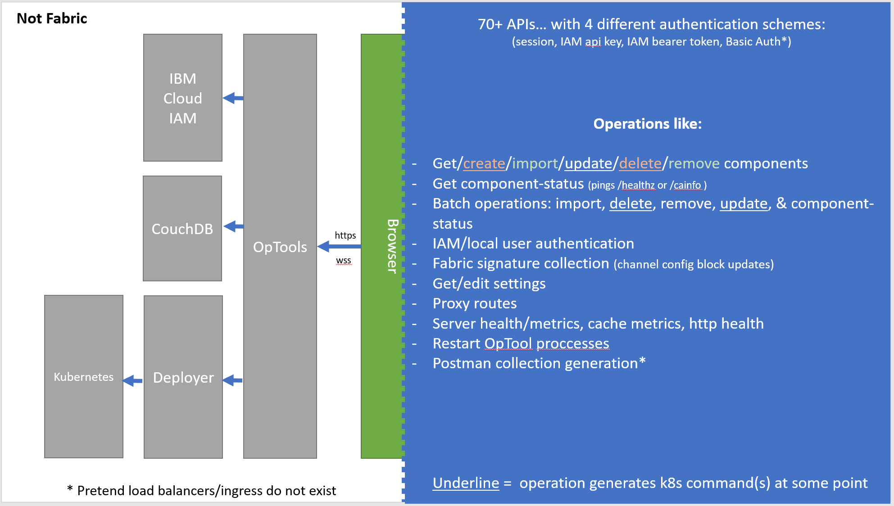
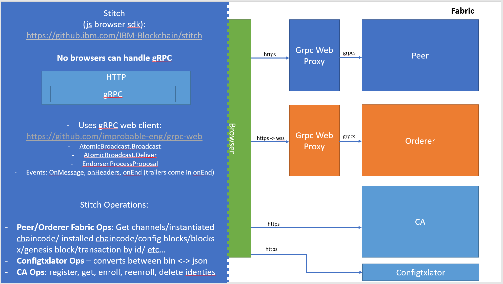
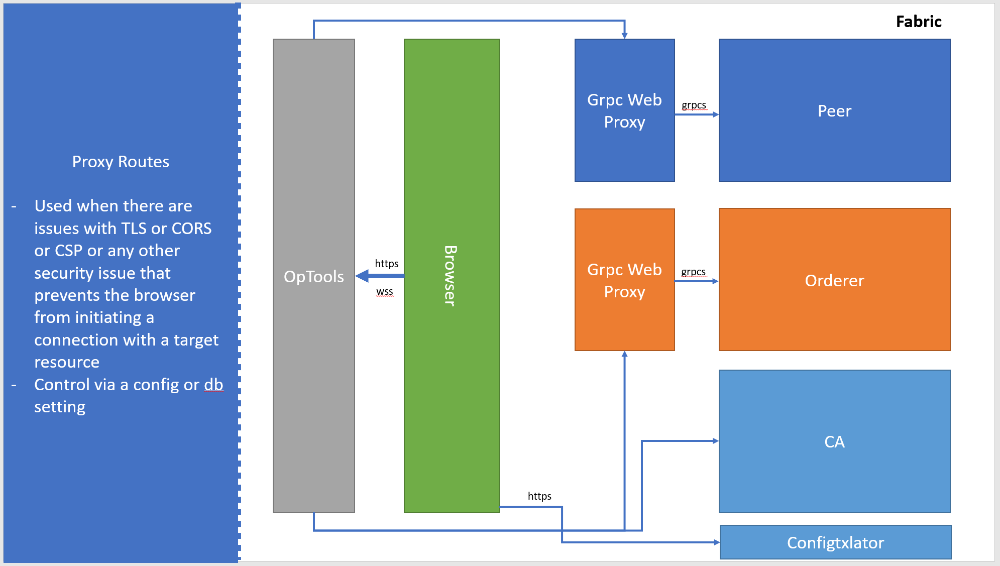

# Architecture

__Detailed Overview__

This was my 2nd stab at a architecture diagram...
Above is a detailed architecture diagram depicting a SaaS deployment.
The example routes in the diagram are showing behavior of a **Paid** plan.
Follow the routes from the `Clients Laptop` box on the bottom to see how different types of operations flow through our architecture.

__Simple Overview__

This is my 3rd stab at a architecture diagram.
This chart shows a simplified version of how OpTools looks.
The center is the **user's** browser.
- Notice that **non-Fabric** operations take place on the left and travel from the browser to our OpTools server (aka Athena).
- However **Fabric** operations take place on the right and travel from the browser directly to a Fabric component.

__Server Overview__

This chart is showing the left side, which only contains **non-Fabric** operations.
This means operations like creating a component, authenticating the user, etc.
The center green box is the end-user's browser.

- Notice that Fabric operations (such as creating a channel) are not handled by our server, ever. The OpTools server never holds private keys. Thus it cannot create a Fabric operation b/c it will be unable to sign the operation.
	- This is why its not possible for us to offer Fabric REST APIs. Fabric operations must occur in the browser (where keys are stored).

__Browser Overview__

This chart is showing the right side, which only contains **Fabric** operations.
The center green box is the end-user's browser.

Fabric operations start in the browser.
The JS client code assembles and signs a Fabric `proposal`.
The `proposal` is sent from the browser to the gRPC Web Proxy which in turn sends it to a component.
The OpTools server is not involved at all.

The purpose of the `gRPC Web Proxy` is to bridge HTTP to gRPC.
We need this because all modern browsers do not support gRPC.
Thus our client JS uses a `gRPC Web Client` to build an HTTP message.
This message is sent to the `gRPC Web Proxy` which can translate HTTP to gRPC.
A gRPC message is then forwarded to the component.
The process is reversed for the response.

Note that the orderer uses a WebSocket (WSS) instead of normal HTTP. This is because the Fabric Orderer expects a bi-directional streaming connection.

Also note that the Fabric CA supports HTTP as is. Thus there is no additional proxy in front.

__Browser Proxy Overview__

There is a setting in Athena to change the routing behavior of Fabric operations.
You can tell OpTools to route Fabric operations through the server (instead of the normal flow).
You might want to do this for multiple reasons, but the most common is to avoid manually accepting self-signed certificates from components.

This is done with the setting `proxy_tls_fabric_reqs`.
More details on how to use the setting are in the [configuration doc](../env/README.md#default).
